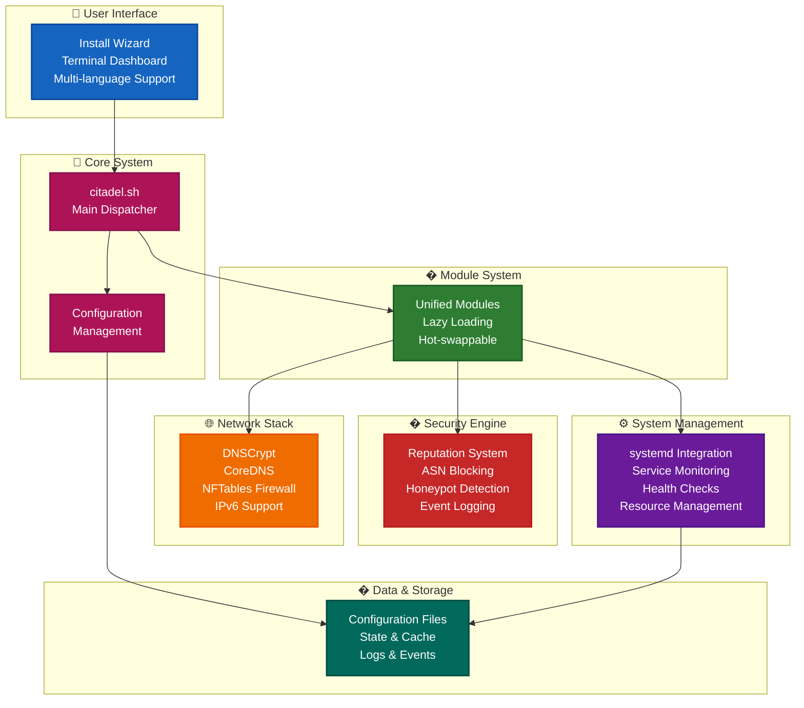

# Citadel v3.3 - Advanced Security Platform

[](https://github.com/QguAr71/Cytadela)
[](LICENSE)
[](https://github.com/QguAr71/Cytadela/stargazers)
[](https://github.com/QguAr71/Cytadela/forks)
[](https://github.com/QguAr71/Cytadela/issues)
[](https://github.com/QguAr71/Cytadela/pulls)
[](https://github.com/QguAr71/Cytadela/commits/main)
[](https://github.com/QguAr71/Cytadela)
[](https://github.com/QguAr71/Cytadela)
[](https://github.com/QguAr71/Cytadela/releases)
[](https://github.com/QguAr71/Cytadela/actions)
[](SECURITY.md)

**Citadel v3.3** is an advanced security platform for Linux systems, offering comprehensive security, monitoring, and management features for advanced users and home environments.

**Keywords:** Linux security, firewall, DNS blocker, network security, cybersecurity tools, privacy protection, threat intelligence, intrusion detection, system administration, home server security, advanced threat protection, open source firewall, cybersecurity, privacy tools, security monitoring, DNS firewall, network monitoring, cybersecurity tools, open source security.

## Table of Contents

- [Overview](#overview)
- [Main Features](#main-features)
- [Installation](#installation)
- [Configuration](#configuration)
- [Usage](#usage)
- [API Documentation](#api-documentation)
- [Troubleshooting](#troubleshooting)
- [Developer Guide](#developer-guide)
- [License](#license)

## Overview

Citadel v3.3 is a modular security platform designed for:
- **Advanced users** - comprehensive security tools
- **Home environments** - complete network protection

The platform integrates multiple security layers into a unified management system.

### Architecture



## Main Features

### Security Features (v3.3.0)

- **Reputation System** - automatic blocking of suspicious IP addresses
- **ASN Blocking** - network-level blocking based on Autonomous System Numbers
- **Event Logging** - structured logs in JSON format
- **Honeypot** - detection and blocking of security scanners

### Management Features

- **YAML Configuration** - configuration management with profiles
- **Module Management** - dynamic loading and unloading of modules
- **systemd Integration** - management of system services
- **Advanced Monitoring** - checking system health

### Advanced User Features

*Note: Advanced features (Prometheus, Grafana, Docker) are planned for future versions*

- **Prometheus/Grafana Integration** - metrics and visualization for monitoring
- **Docker Integration** - containerization of services for isolation
- **Advanced Security** - firewall rules, threat intelligence
- **Scalability** - performance optimization and resource management

## Installation

### 🚀 Quick Install (Recommended for Beginners)
The easiest way to install Citadel is using our interactive installer:

```bash
git clone https://github.com/QguAr71/Cytadela.git
cd Cytadela
sudo ./install-wizard.sh
```

**📖 [Detailed Installation Guide](docs/user/install-wizard-guide-en.md)** - Step-by-step instructions for beginners

### System Requirements

- **Operating System**: Linux (Ubuntu, Debian, CentOS, Fedora, Arch)
- **Permissions**: root/sudo
- **Dependencies**: bash, nftables, systemd, curl, jq, yq (optional)

### Quick Installation

```bash
# Download Citadel
git clone https://github.com/QguAr71/Cytadela.git
cd Cytadela

# Run installer
sudo ./scripts/citadel-install-cli.sh

# Or with options
sudo ./scripts/citadel-install-cli.sh --profile full --components all --verbose
```

### Installation Profiles

| Profile | Description | Components |
|---------|-------------|------------|
| `standard` | Basic security functions | reputation, logging, config |
| `security` | Advanced security | all security functions |
| `full` | Complete functions for advanced users | all components + integrations |

### Installer Options

```bash
./scripts/citadel-install-cli.sh [OPTIONS]

Options:
  --profile PROFILE      Installation profile (standard/security/full)
  --components LIST      Comma-separated list of components to install
  --dry-run             Show what would be installed without making changes
  --verbose             Enable verbose output
  --gum-enhanced         Use gum TUI for enhanced user experience (installs gum if needed)
  --backup-existing      Create backups of existing configurations (enabled by default)
  --select-components    Interactive component selection
  --help, -h            Show this help message
```

### Manual Installation

```bash
# 1. Copy files
sudo cp -r lib/* /usr/local/lib/citadel/
sudo cp citadel.sh /usr/local/bin/citadel.sh
sudo chmod +x /usr/local/bin/citadel.sh

# 2. Create configuration directories
sudo mkdir -p /etc/citadel /var/log/citadel /var/run/citadel

# 3. Initialize configuration
sudo citadel.sh unified-security-init
```

## Configuration

### Configuration Structure

Citadel uses YAML format for configuration. Main configuration file: `/etc/citadel/config.yaml`

```yaml
# Citadel v3.3 Configuration
version: "3.3.0"
profile: "full"

# Logging
logging:
  level: "info"
  file: "/var/log/citadel/citadel.log"
  max_size: "100MB"
  max_files: 5

# Security Features
security:
  reputation:
    enabled: true
    threshold: 50
    auto_block: true
    block_duration: "24h"

  asn_blocking:
    enabled: true
    whitelist: ["AS12345", "AS67890"]
    update_interval: "6h"

  event_logging:
    enabled: true
    format: "json"
    retention: "30d"

  honeypot:
    enabled: true
    ports: [22, 80, 443, 3389]

# Advanced Features
advanced:
  prometheus:
    enabled: true
    port: 9090
    metrics_interval: "15s"

  grafana:
    enabled: true
    port: 3000
    admin_password: "secure_password"

  docker:
    enabled: false
    compose_file: "/etc/citadel/docker-compose.yml"

# Network Configuration
network:
  interfaces: ["eth0", "wlan0"]
  firewall_backend: "nftables"
  geo_blocking: false
  threat_feeds:
    enabled: true
    update_interval: "1h"
```

### Configuration Profiles

Citadel supports configuration profiles for different environments:

- **`default`** - basic configuration
- **`security`** - enhanced security settings
- **`full`** - complete functions for advanced users
- **`minimal`** - minimal configuration

### Configuration Management

*Note: Advanced configuration management is planned for future versions*

## Usage

### Basic Commands

```bash
# Show help
citadel.sh --help

# Check system status
citadel.sh status

# Show version
citadel.sh version
```

### Security Management

#### Reputation System

```bash
# Show IP reputation
citadel.sh reputation list

# Check specific IP reputation
citadel.sh reputation score 192.168.1.100

# Add to blacklist
citadel.sh reputation block 192.168.1.100

# Remove from blacklist
citadel.sh reputation unblock 192.168.1.100

# Show statistics
citadel.sh reputation stats
```

#### ASN Blocking

```bash
# Add ASN to block
citadel.sh asn-block add AS12345

# Remove ASN from block
citadel.sh asn-block remove AS12345

# Show blocked ASNs
citadel.sh asn-block list

# Update prefix list
citadel.sh asn-block update

# Show statistics
citadel.sh asn-block stats
```

#### Event Logging

```bash
# Log event
citadel.sh events log "Suspicious activity detected" security alert

# Search logs
citadel.sh events query --level error --since 1h

# Show statistics
citadel.sh events stats

# Rotate logs
citadel.sh events rotate

# Analyze logs
citadel.sh events analyze --period 24h
```

#### Honeypot

```bash
# Start honeypot
citadel.sh honeypot start

# Stop honeypot
citadel.sh honeypot stop

# Check status
citadel.sh honeypot status

# Show connection logs
citadel.sh honeypot logs

# Clean honeypot
citadel.sh honeypot cleanup
```

### Module Management

*Note: Advanced module management is planned for future versions*

```bash
# Module management - not available in v3.3
# module-list           - planned for v3.4
# module-load           - planned for v3.4
# module-unload         - planned for v3.4
# module-reload         - planned for v3.4
# module-info           - planned for v3.4
```

### Service Management

*Note: Advanced service management is planned for future versions*

```bash
# Service management - not available in v3.3
# service-create        - planned for v3.4
# service-start         - planned for v3.4
# service-stop          - planned for v3.4
# service-restart       - planned for v3.4
# service-enable        - planned for v3.4
# service-disable       - planned for v3.4
# service-status        - planned for v3.4
# service-list          - planned for v3.4
```

### System Monitoring

```bash
# Check system health
citadel.sh monitoring-health-check

# Show system information
citadel.sh monitoring-system-info
```

## API Documentation

*Note: API documentation is planned for future versions*

## Troubleshooting

### Installation Problems

#### Problem: Permission denied

```
Error: Permission denied
```

**Solution:**
```bash
# Run with sudo
sudo ./scripts/citadel-install-cli.sh

# Or set permissions
chmod +x citadel.sh
chmod +x scripts/citadel-install-cli.sh
```

#### Problem: Missing dependencies

```
Error: yq command not found
```

**Solution:**
```bash
# Install dependencies
sudo apt-get update
sudo apt-get install jq curl wget nftables systemd

# For yq (optional)
sudo wget https://github.com/mikefarah/yq/releases/latest/download/yq_linux_amd64 -O /usr/local/bin/yq
sudo chmod +x /usr/local/bin/yq
```

### Security Problems

#### Problem: Firewall not working

```
Error: nftables rules failed
```

**Solution:**
```bash
# Check nftables status
sudo systemctl status nftables

# Reload rules
sudo nft flush ruleset
sudo citadel.sh security reload
```

#### Problem: Modules not loading

```
Error: Module not found
```

**Solution:**
```bash
# Check available modules
citadel.sh module-list

# Discover modules
citadel.sh module-discover

# Check paths
ls -la lib/ modules/
```

### Service Problems

#### Problem: Service not starting

```
Error: Service failed to start
```

**Solution:**
```bash
# Check systemd logs
sudo journalctl -u citadel-main.service

# Check status
sudo systemctl status citadel-main.service

# Reload systemd
sudo systemctl daemon-reload
```

#### Problem: Port conflicts

```
Error: Port already in use
```

**Solution:**
```bash
# Find process using port
sudo lsof -i :9090

# Change port in configuration
citadel.sh config-set advanced.prometheus.port 9091
```

### Performance Problems

#### Problem: High CPU usage

**Diagnosis:**
```bash
# Check resource usage
citadel.sh advanced-metrics

# Check processes
top -p $(pgrep citadel)
```

**Solution:**
```bash
# Optimize configuration
citadel.sh config-set logging.level warning
citadel.sh config-set security.reputation.update_interval 300
```

#### Problem: Low disk space

**Solution:**
```bash
# Rotate logs
citadel.sh events rotate

# Clean old logs
sudo find /var/log/citadel -name "*.log.*" -mtime +30 -delete
```

### Integration Problems

#### Problem: Prometheus not collecting metrics

**Solution:**
```bash
# Check configuration
cat /etc/prometheus/citadel.yml

# Restart Prometheus
sudo systemctl restart prometheus

# Check status
curl http://localhost:9090/-/healthy
```

#### Problem: Docker containers not starting

**Solution:**
```bash
# Check Docker status
sudo systemctl status docker

# Check configuration
cat /etc/citadel/docker-compose.yml

# Start containers
cd /etc/citadel && docker-compose up -d
```

### Diagnostic Logs

```bash
# Show all logs
sudo journalctl -u citadel-*

# Application logs
tail -f /var/log/citadel/citadel.log

# Security logs
tail -f /var/log/citadel/security.log

# Event logs
citadel.sh events query --level error --tail 50
```

## Developer Guide

### Project Structure

```
Citadel v3.3/
├── citadel.sh                 # Main executable file
├── CHANGELOG.md              # Change history
├── LICENSE                   # License
├── README.md                 # Main documentation
├── docs/                     # Multi-language documentation
│   ├── en/                   # English documentation
│   └── pl/                   # Polish documentation
├── lib/                      # Module libraries
├── modules/                  # Unified modules
├── scripts/                  # Installation scripts
├── config/                   # Configuration templates
├── examples/                 # Example configurations
└── tests/                    # Tests
```

### Creating a New Module

1. **Create module file** in `lib/` or `modules/unified/`

```bash
# lib/my-module.sh
# @description My new module
# @version 1.0.0

my_module_function() {
    echo "Hello from my module!"
}

my_module_init() {
    echo "Initializing my module..."
    # Module initialization
}

my_module_cleanup() {
    echo "Cleaning up my module..."
    # Module cleanup
}
```

2. **Add to module management system**

The module will be automatically discovered by `module-discover`.

3. **Add commands to main dispatcher**

```bash
# In citadel.sh, add to case statement:
my-command)
    smart_load_module "my-module"
    my_module_function "$@"
    ;;
```

### Module Testing

```bash
# Run tests
./tests/run-tests.sh

# Test specific module
./tests/test-module.sh my-module

# Test integration
./tests/integration-tests.sh
```

### Debugging

```bash
# Enable debugging
export CITADEL_DEBUG=1

# Check logs
tail -f /var/log/citadel/citadel.log

# Debug modules
citadel.sh module-info my-module

# Check environment variables
env | grep CITADEL
```

### Best Practices

#### Coding
- Use `#!/bin/bash` as shebang
- Check for errors: `set -euo pipefail`
- Use functions instead of global variables
- Document functions with `@description` comments
- Używaj `#!/bin/bash` jako shebang
- Sprawdzaj błędy: `set -euo pipefail`
- Używaj funkcji zamiast globalnych zmiennych
- Dokumentuj funkcje z komentarzami `@description`

#### Bezpieczeństwo
- Sprawdzaj uprawnienia przed operacjami
- Używaj `sudo` tylko gdy konieczne
- Waliduj dane wejściowe
- Unikaj injection w komendach

#### Wydajność
- Buforuj wyniki kosztownych operacji
- Używaj `mktemp` dla plików tymczasowych
- Ograniczaj ilość logów w pętach
- Używaj `nice` dla zadań w tle

#### Obsługa błędów
```bash
error_exit() {
    echo "Error: $1" >&2
    exit 1
}

# Sprawdź warunki
[[ -f "$file" ]] || error_exit "File not found: $file"
```

## 📄 Licencja

Citadel v3.3 jest dostępny na licencji MIT. Zobacz plik `LICENSE` dla szczegółów.

## 🤝 Wsparcie

- **Dokumentacja**: [docs/](docs/)
- **Issues**: [GitHub Issues](https://github.com/QguAr71/Cytadela/issues)
- **Wiki**: [GitHub Wiki](https://github.com/QguAr71/Cytadela/wiki)
- **Forum**: [GitHub Discussions](https://github.com/QguAr71/Cytadela/discussions)

## 🙏 Podziękowania

- Wspólnocie open source za narzędzia i biblioteki
- Testerom beta za cenne uwagi
- Wszystkim współtwórcom projektu

---

## 🆕 **Najnowsze zmiany w v3.4.0 (2026-02-06)**

### 🌍 **Rozszerzenie internacjonalizacji - 7 języków kompletne**

**Rozszerzenie wsparcia językowego z 2 do 7 języków dla wszystkich modułów Citadel:**

#### ✨ **Nowe języki dodane:**
- **Niemiecki (de)** - pełne tłumaczenie wszystkich modułów
- **Hiszpański (es)** - kompletna lokalizacja hiszpańska
- **Francuski (fr)** - kompleksowe tłumaczenia francuskie
- **Włoski (it)** - pełne wsparcie języka włoskiego
- **Rosyjski (ru)** - kompletne tłumaczenia rosyjskie

#### 📊 **Statystyki rozszerzenia:**
- **Przed:** 2 języki (polski, angielski) - częściowe pokrycie
- **Po:** 7 języków (pl, en, de, es, fr, it, ru) - kompletne pokrycie
- **Moduły objęte:** common, install, uninstall, recovery, help
- **Łącznie tłumaczeń:** 1000+ stringów per język × 7 języków
- **Jakość:** Wszystkie stringi używają wzorca `${T_KEY:-fallback}`

### 🏗️ **Kompletny modularny system pomocy**

**Całkowita przebudowa systemu pomocy Citadel z nowoczesnymi interfejsami dla wszystkich poziomów użytkowników:**

#### 🖥️ **Nowy interfejs TUI (Terminal User Interface)**
- **Gum-powered interface** - nowoczesny, piękny interfejs terminalowy
- **Interaktywne menu** - łatwa nawigacja dla początkujących
- **Funkcjonalność wyszukiwania** - znajdź komendy i pomoc błyskawicznie
- **Kontekstowa pomoc** - inteligentne sugestie na podstawie stanu systemu

#### 💻 **Nowy interfejs CLI (Command Line Interface)**
- **Przyjazny dla skryptów** - idealny dla automatyzacji i zaawansowanych użytkowników
- **Szczegółowe informacje o komendach** - przykłady, użycie i uwagi
- **Wsparcie formatu JSON** - dla programistycznego użycia
- **Wyszukiwanie i filtrowanie** - szybki dostęp do konkretnych informacji

#### 🎯 **System pomocy kontekstowej**
- **Wskazówki dotyczące workflow** - krok-po-kroku tutoriale dla złożonych zadań
- **Inteligentne sugestie** - pomoc kontekstowa na podstawie bieżącego stanu systemu
- **Wskazówki dla początkujących użytkowników** - kompletne przewodniki instalacji
- **Pomoc w rozwiązywaniu problemów** - przewodniki rozwiązywania problemów

#### 📚 **Kompleksowa dokumentacja**
- **Struktura JSON modularna** - łatwa do utrzymania i rozszerzania
- **5 modułów w pełni udokumentowanych** - install, core, addons, advanced, emergency
- **Przewodniki rozwiązywania problemów** - problemy z DNS, instalacją, firewallem
- **Tutoriale szybkiego startu** - uruchomienie w 5 minut
- **Wielojęzyczna obsługa** - cała zawartość pomocy w 7 językach

### 🔧 **Ulepszenia architektury**

#### 📁 **Nowa architektura systemu pomocy:**
```
lib/help/
├── framework/           # Rdzeń systemu (help-core.sh)
├── interfaces/          # Interfejsy TUI, CLI, kontekstowy
│   ├── tui/            # Gum-based terminal UI
│   ├── cli/            # Command-line interface
│   └── help-context.sh # Kontekstowa pomoc systemowa
├── modules/             # Modularna dokumentacja
└── docs/               # Przewodniki i tutoriale
    ├── quick-start/    # Przewodniki szybkiego startu
    └── troubleshooting/# Rozwiązywanie problemów
```

#### 🔗 **Integracja z systemem:**
- **Bezproblemowa integracja z citadel.sh** - nowa struktura komend pomocy
- **Automatyczne wykrywanie języka** - inteligentne ustawienia domyślne
- **Kompatybilność wsteczna** - stare komendy pomocy nadal działają
- **Wielointerfejsowe wysyłanie** - automatyczne routing do odpowiedniego interfejsu

### 🎨 **Ulepszenia doświadczenia użytkownika**

#### 👥 **Wsparcie dla wielu poziomów użytkowników:**
- **Początkujący** → Interaktywny TUI z przewodnikami krok-po-kroku
- **Zaawansowani użytkownicy** → Szybki CLI z szczegółowymi informacjami
- **Programiści** → Kontekstowa pomoc z szczegółami technicznymi
- **Administratorzy systemów** → Przewodniki rozwiązywania problemów i diagnostyka

#### 🌐 **Globalna baza użytkowników:**
- **7 języków** - wsparcie dla globalnej społeczności użytkowników
- **Spójne doświadczenie** - taka sama jakość we wszystkich językach
- **Adaptacja kulturowa** - formatowanie i konwencje specyficzne dla języka

### 📊 **Statystyki implementacji:**
- **Nowe pliki:** 35+ plików systemu pomocy
- **Tłumaczenia:** 1000+ stringów per język × 7 języków
- **Linie kodu:** 2000+ linii nowego kodu systemu pomocy
- **Moduły udokumentowane:** 5 głównych modułów Citadel w pełni
- **Interfejsy użytkownika:** 3 różne interfejsy (TUI, CLI, kontekstowy)
- **Pakiety językowe obsługiwane:** 7 kompletnych pakietów językowych

### 🔄 **Zmiany wprowadzające:**
- **Nowa struktura komend pomocy:**
  - `citadel help` → Interaktywny TUI (domyślny)
  - `citadel help --cli komenda` → Pomoc CLI
  - `citadel help --context workflow` → Wskazówki kontekstowe
- **Rozszerzone pokrycie i18n** - wszystkie stringi użytkownika są teraz zlokalizowane

### 🎯 **Ścieżka migracji:**
- **Automatyczne wykrywanie interfejsu** - inteligentne routing na podstawie kontekstu
- **Zachowana kompatybilność wsteczna** - stare komendy pomocy przekierowują odpowiednio
- **Ulepszanie progresywne** - nowe funkcje nie psują istniejącego użycia

---

**Citadel v3.4.0** - Bezpieczeństwo na najwyższym poziomie z wsparciem wielojęzycznym! 🛡️🌍

## ✨ Główne funkcje

### 🔒 Funkcje bezpieczeństwa (v3.3.0)

- **System reputacji** - automatyczne blokowanie podejrzanych adresów IP
- **Blokowanie ASN** - kontrola ruchu na podstawie Autonomous System Numbers
- **Logowanie zdarzeń** - strukturalne logi w formacie JSON
- **Honeypot** - wykrywanie i blokowanie skanerów bezpieczeństwa

### 🎯 Funkcje zarządzania

- **Konfiguracja YAML** - zarządzanie konfiguracją z profilami
- **Zarządzanie modułami** - dynamiczne ładowanie i rozładowywanie modułów
- **Integracja systemd** - zarządzanie usługami systemowymi
- **Zaawansowane monitorowanie** - sprawdzanie zdrowia systemu

### 🏢 Funkcje korporacyjne

- **Integracja Prometheus/Grafana** - metryki i wizualizacja
- **Docker Integration** - konteneryzacja usług
- **Zaawansowane bezpieczeństwo** - reguły firewall, threat intelligence
- **Skalowalność** - load balancing, high availability

## 🚀 Instalacja

### Wymagania systemowe

- **System operacyjny**: Linux (Ubuntu, Debian, CentOS, Fedora, Arch)
- **Uprawnienia**: root/sudo
- **Zależności**: bash, nftables, systemd, curl, jq, yq (opcjonalnie)

### Szybka instalacja

```bash
# Pobierz Citadel
git clone https://github.com/QguAr71/Cytadela.git
cd Cytadela

# Uruchom instalator
sudo ./scripts/citadel-install-cli.sh

# Lub z opcjami
sudo ./scripts/citadel-install-cli.sh --profile enterprise --components all --verbose
```

### Profile instalacji

| Profil | Opis | Komponenty |
|--------|------|------------|
| `standard` | Podstawowe funkcje bezpieczeństwa | reputation, logging, config |
| `security` | Zaawansowane bezpieczeństwo | wszystkie funkcje bezpieczeństwa |
| `enterprise` | Pełne funkcje korporacyjne | wszystkie komponenty + integracje |

### Opcje instalatora

```bash
./scripts/citadel-install-cli.sh [OPCJE]

Opcje:
  --profile PROFILE      Profil instalacji (standard/security/enterprise)
  --components LIST      Lista komponentów (przecinek)
  --dry-run             Symulacja instalacji
  --verbose             Szczegółowe logowanie
  --no-service          Bez tworzenia usług systemd
  --help                Wyświetl pomoc
```

### Instalacja ręczna

```bash
# 1. Skopiuj pliki
sudo cp -r lib/* /usr/local/lib/citadel/
sudo cp citadel.sh /usr/local/bin/citadel.sh
sudo chmod +x /usr/local/bin/citadel.sh

# 2. Utwórz katalogi konfiguracyjne
sudo mkdir -p /etc/citadel /var/log/citadel /var/run/citadel

# 3. Zainicjalizuj konfigurację
sudo citadel.sh config-init

# 4. Zainicjalizuj moduły bezpieczeństwa
sudo citadel.sh unified-security-init
```

## ⚙️ Konfiguracja

### Struktura konfiguracji

Citadel używa formatu YAML dla konfiguracji. Główny plik konfiguracyjny: `/etc/citadel/config.yaml`

```yaml
# Citadel v3.3 Configuration
version: "3.3.0"
profile: "enterprise"

# Logging
logging:
  level: "info"
  file: "/var/log/citadel/citadel.log"
  max_size: "100MB"
  max_files: 5

# Security Features
security:
  reputation:
    enabled: true
    threshold: 50
    auto_block: true
    block_duration: "24h"

  asn_blocking:
    enabled: true
    whitelist: ["AS12345", "AS67890"]
    update_interval: "6h"

  event_logging:
    enabled: true
    format: "json"
    retention: "30d"

  honeypot:
    enabled: true
    ports: [22, 80, 443, 3389]
    log_connections: true

# Advanced Features
enterprise:
  prometheus:
    enabled: true
    port: 9090
    metrics_interval: "15s"

  grafana:
    enabled: true
    port: 3000
    admin_password: "secure_password"

  docker:
    enabled: false
    compose_file: "/etc/citadel/docker-compose.yml"

# Network Configuration
network:
  interfaces: ["eth0", "wlan0"]
  firewall_backend: "nftables"
  geo_blocking: false
  threat_feeds:
    enabled: true
    update_interval: "1h"
```

### Profile konfiguracyjne

Citadel wspiera profile konfiguracyjne dla różnych środowisk:

- **`default`** - konfiguracja podstawowa
- **`security`** - wzmocnione ustawienia bezpieczeństwa
- **`enterprise`** - pełne funkcje korporacyjne
- **`minimal`** - minimalna konfiguracja

### Zarządzanie konfiguracją

```bash
# Inicjalizacja konfiguracji
citadel.sh config-init

# Wyświetlenie konfiguracji
citadel.sh config-show
citadel.sh config-show security.reputation

# Modyfikacja ustawień
citadel.sh config-set security.reputation.threshold 75
citadel.sh config-set logging.level debug

# Walidacja konfiguracji
citadel.sh config-validate

# Zarządzanie profilami
citadel.sh config-list-profiles
citadel.sh config-switch-profile enterprise
citadel.sh config-apply

# Eksport/import
citadel.sh config-export /backup/citadel-config.yaml
citadel.sh config-import /backup/citadel-config.yaml

# Porównanie konfiguracji
citadel.sh config-diff /path/to/other-config.yaml
```

## 📖 Użytkowanie

### Podstawowe polecenia

```bash
# Wyświetl pomoc
citadel.sh --help

# Sprawdź status systemu
citadel.sh status

# Wyświetl wersję
citadel.sh version
```

### Zarządzanie bezpieczeństwem

#### System reputacji

```bash
# Wyświetl reputację adresów IP
citadel.sh reputation list

# Sprawdź reputację konkretnego IP
citadel.sh reputation score 192.168.1.100

# Dodaj do czarnej listy
citadel.sh reputation block 192.168.1.100

# Usuń z czarnej listy
citadel.sh reputation unblock 192.168.1.100

# Wyświetl statystyki
citadel.sh reputation stats
```

#### Blokowanie ASN

```bash
# Dodaj ASN do blokady
citadel.sh asn-block add AS12345

# Usuń ASN z blokady
citadel.sh asn-block remove AS12345

# Wyświetl zablokowane ASN
citadel.sh asn-block list

# Aktualizuj listę prefiksów
citadel.sh asn-block update

# Wyświetl statystyki
citadel.sh asn-block stats
```

#### Logowanie zdarzeń

```bash
# Zaloguj zdarzenie
citadel.sh events log "Wykryto podejrzane działanie" security alert

# Przeszukaj logi
citadel.sh events query --level error --since 1h

# Wyświetl statystyki
citadel.sh events stats

# Obróć logi
citadel.sh events rotate

# Analiza logów
citadel.sh events analyze --period 24h
```

#### Honeypot

```bash
# Uruchom honeypot
citadel.sh honeypot start

# Zatrzymaj honeypot
citadel.sh honeypot stop

# Sprawdź status
citadel.sh honeypot status

# Wyświetl logi połączeń
citadel.sh honeypot logs

# Wyczyść honeypot
citadel.sh honeypot cleanup
```

### Zarządzanie modułami

```bash
# Wyświetl dostępne moduły
citadel.sh module-list

# Załaduj moduł
citadel.sh module-load unified-security

# Rozładuj moduł
citadel.sh module-unload unified-security

# Przeładuj moduł
citadel.sh module-reload unified-security

# Informacje o module
citadel.sh module-info unified-security

# Załaduj wszystkie moduły
citadel.sh module-load-all

# Odkryj nowe moduły
citadel.sh module-discover
```

### Zarządzanie usługami

```bash
# Wyświetl usługi Citadel
citadel.sh service-list

# Utwórz usługę
citadel.sh service-create main

# Uruchom usługę
citadel.sh service-start citadel-main

# Zatrzymaj usługę
citadel.sh service-stop citadel-main

# Zrestartuj usługę
citadel.sh service-restart citadel-main

# Włącz auto-start
citadel.sh service-enable citadel-main

# Wyłącz auto-start
citadel.sh service-disable citadel-main

# Status usługi
citadel.sh service-status citadel-main

# Skonfiguruj wszystkie usługi
citadel.sh service-setup-all

# Usuń wszystkie usługi
citadel.sh service-remove-all
```

### Monitorowanie systemu

```bash
# Sprawdź zdrowie systemu
citadel.sh monitoring-health-check

# Wyświetl informacje o systemie
citadel.sh monitoring-system-info
```

### Funkcje korporacyjne

```bash
# Inicjalizuj funkcje enterprise
citadel.sh enterprise-init

# Sprawdź status enterprise
citadel.sh enterprise-status

# Wyświetl metryki
citadel.sh enterprise-metrics

# Skonfiguruj Prometheus
citadel.sh prometheus-setup

# Skonfiguruj Grafana
citadel.sh grafana-setup

# Skonfiguruj Docker
citadel.sh docker-setup

# Inicjalizuj bezpieczeństwo enterprise
citadel.sh enterprise-security-init

# Inicjalizuj skalowalność
citadel.sh scalability-init
```

### Interfejs graficzny (Gum TUI)

Citadel oferuje interaktywny interfejs tekstowy oparty na Gum:

```bash
# Uruchom dashboard
citadel.sh dashboard

# Menu główne:
# - Status systemu
# - Przegląd bezpieczeństwa
# - Konfiguracja
# - Monitorowanie
# - Kontrola usług
# - Logi zdarzeń
```

## 📚 Dokumentacja API

### Struktura modułów

Citadel używa modularnej architektury z następującymi typami modułów:

- **Unified Modules** (`modules/unified/`) - główne funkcje systemowe
- **Library Modules** (`lib/`) - biblioteki pomocnicze

### Interfejs modułu

Każdy moduł powinien implementować standardowy interfejs:

```bash
# @description Opis modułu
# @version Wersja modułu

module_function() {
    # Implementacja funkcji modułu
}

module_init() {
    # Inicjalizacja modułu
}

module_cleanup() {
    # Czyszczenie modułu
}
```

### Hook system

Citadel wspiera system hook'ów dla rozszerzania funkcjonalności:

```bash
# Rejestracja hook'a
register_hook "security_check" "my_security_function"

# Wywołanie hook'ów
call_hooks "security_check" "$param1" "$param2"
```

### API bezpieczeństwa

#### Reputation API

```bash
reputation_get_score() {
    local ip="$1"
    # Zwraca score reputacji dla IP
}

reputation_block_ip() {
    local ip="$1"
    # Blokuje IP w firewall
}

reputation_unblock_ip() {
    local ip="$1"
    # Odblokowuje IP
}
```

#### Event Logging API

```bash
event_log() {
    local message="$1"
    local category="$2"
    local level="${3:-info}"
    # Loguje zdarzenie
}

event_query() {
    local filter="$1"
    # Przeszukuje logi zdarzeń
}
```

### Konfiguracja API

```bash
config_get() {
    local key="$1"
    # Pobiera wartość konfiguracji
}

config_set() {
    local key="$1"
    local value="$2"
    # Ustawia wartość konfiguracji
}

config_validate() {
    # Waliduje konfigurację
}
```

## 🔧 Rozwiązywanie problemów

### Problemy z instalacją

#### Problem: Brak uprawnień

```
Error: Permission denied
```

**Rozwiązanie:**
```bash
# Uruchom z sudo
sudo ./scripts/citadel-install-cli.sh

# Lub nadaj uprawnienia
chmod +x citadel.sh
chmod +x scripts/citadel-install-cli.sh
```

#### Problem: Brakujące zależności

```
Error: yq command not found
```

**Rozwiązanie:**
```bash
# Zainstaluj zależności
sudo apt-get update
sudo apt-get install jq curl wget nftables systemd

# Dla yq (opcjonalnie)
sudo wget https://github.com/mikefarah/yq/releases/latest/download/yq_linux_amd64 -O /usr/local/bin/yq
sudo chmod +x /usr/local/bin/yq
```

### Problemy z bezpieczeństwem

#### Problem: Firewall nie działa

```
Error: nftables rules failed
```

**Rozwiązanie:**
```bash
# Sprawdź status nftables
sudo systemctl status nftables

# Przeładuj reguły
sudo nft flush ruleset
sudo citadel.sh security reload
```

#### Problem: Moduły nie ładują się

```
Error: Module not found
```

**Rozwiązanie:**
```bash
# Sprawdź dostępne moduły
citadel.sh module-list

# Odkryj moduły
citadel.sh module-discover

# Sprawdź ścieżki
ls -la lib/ modules/
```

### Problemy z usługami

#### Problem: Usługa nie uruchamia się

```
Error: Service failed to start
```

**Rozwiązanie:**
```bash
# Sprawdź logi systemd
sudo journalctl -u citadel-main.service

# Sprawdź status
sudo systemctl status citadel-main.service

# Przeładuj systemd
sudo systemctl daemon-reload
```

#### Problem: Konflikt portów

```
Error: Port already in use
```

**Rozwiązanie:**
```bash
# Znajdź proces używający portu
sudo lsof -i :9090

# Zmień port w konfiguracji
citadel.sh config-set enterprise.prometheus.port 9091
```

### Problemy z wydajnością

#### Problem: Wysokie użycie CPU

**Diagnoza:**
```bash
# Sprawdź użycie zasobów
citadel.sh enterprise-metrics

# Sprawdź procesy
top -p $(pgrep citadel)
```

**Rozwiązanie:**
```bash
# Zoptymalizuj konfigurację
citadel.sh config-set logging.level warning
citadel.sh config-set security.reputation.update_interval 300
```

#### Problem: Brak miejsca na dysku

**Rozwiązanie:**
```bash
# Obróć logi
citadel.sh events rotate

# Wyczyść stare logi
sudo find /var/log/citadel -name "*.log.*" -mtime +30 -delete
```

### Problemy z integracją

#### Problem: Prometheus nie zbiera metryk

**Rozwiązanie:**
```bash
# Sprawdź konfigurację
cat /etc/prometheus/citadel.yml

# Zrestartuj Prometheus
sudo systemctl restart prometheus

# Sprawdź status
curl http://localhost:9090/-/healthy
```

#### Problem: Docker kontenery nie uruchamiają się

**Rozwiązanie:**
```bash
# Sprawdź status Docker
sudo systemctl status docker

# Sprawdź konfigurację
cat /etc/citadel/docker-compose.yml

# Uruchom kontenery
cd /etc/citadel && docker-compose up -d
```

### Logi diagnostyczne

```bash
# Wyświetl wszystkie logi
sudo journalctl -u citadel-*

# Logi aplikacji
tail -f /var/log/citadel/citadel.log

# Logi bezpieczeństwa
tail -f /var/log/citadel/security.log

# Logi zdarzeń
citadel.sh events query --level error --tail 50
```

## 🛠️ Przewodnik programisty

### Struktura projektu

```
Citadel v3.3/
├── citadel.sh                 # Główny plik wykonywalny
├── CHANGELOG.md              # Historia zmian
├── LICENSE                   # Licencja
├── README.md                 # Główna dokumentacja (EN)
├── docs/                     # Dokumentacja wielojęzyczna
│   ├── en/                   # Dokumentacja angielska
│   │   ├── README_EN.md      # Główna dokumentacja EN
│   │   └── directory-structure.md # Struktura katalogów
│   └── pl/                   # Dokumentacja polska
│       ├── README_PL.md      # Główna dokumentacja PL
│       ├── komendy_pl.md     # Referencja komend PL
│       ├── szybki_start_pl.md # Szybki start PL
│       ├── rozwiązywanie_problemów_pl.md # Troubleshooting PL
│       └── dziennik_zmian_pl.md # Changelog PL
├── lib/                      # Biblioteki modułów
├── modules/                  # Moduły zunifikowane
├── scripts/                  # Skrypty instalacyjne
├── config/                   # Szablony konfiguracji
├── examples/                 # Przykładowe konfiguracje
└── tests/                    # Testy
```

### Tworzenie nowego modułu

1. **Utwórz plik modułu** w `lib/` lub `modules/unified/`

```bash
# lib/my-module.sh
# @description Mój nowy moduł
# @version 1.0.0

my_module_function() {
    echo "Hello from my module!"
}

my_module_init() {
    echo "Initializing my module..."
    # Inicjalizacja modułu
}

my_module_cleanup() {
    echo "Cleaning up my module..."
    # Czyszczenie modułu
}
```

2. **Dodaj do systemu zarządzania modułami**

Moduł zostanie automatycznie wykryty przez `module-discover`.

3. **Dodaj komendy do głównego dispatcher'a**

```bash
# W citadel.sh, dodaj do case statement:
my-command)
    smart_load_module "my-module"
    my_module_function "$@"
    ;;
```

### Testowanie modułów

```bash
# Uruchom testy
./tests/run-tests.sh

# Testuj konkretny moduł
./tests/test-module.sh my-module

# Testuj integrację
./tests/integration-tests.sh
```

### Debugowanie

```bash
# Włącz debugowanie
export CITADEL_DEBUG=1

# Sprawdź logi
tail -f /var/log/citadel/citadel.log

# Debuguj moduły
citadel.sh module-info my-module

# Sprawdź zmienne środowiskowe
env | grep CITADEL
```

### Najlepsze praktyki

#### Kodowanie
- Używaj `#!/bin/bash` jako shebang
- Sprawdzaj błędy: `set -euo pipefail`
- Używaj funkcji zamiast globalnych zmiennych
- Dokumentuj funkcje z komentarzami `@description`

#### Bezpieczeństwo
- Sprawdzaj uprawnienia przed operacjami
- Używaj `sudo` tylko gdy konieczne
- Waliduj dane wejściowe
- Unikaj injection w komendach

#### Wydajność
- Buforuj wyniki kosztownych operacji
- Używaj `mktemp` dla plików tymczasowych
- Ograniczaj ilość logów w pętach
- Używaj `nice` dla zadań w tle

### Najlepsze praktyki

#### Kodowanie
- Używaj `#!/bin/bash` jako shebang
- Sprawdzaj błędy: `set -euo pipefail`
- Używaj funkcji zamiast globalnych zmiennych
- Dokumentuj funkcje z komentarzami `@description`

#### Bezpieczeństwo
- Sprawdzaj uprawnienia przed operacjami
- Używaj `sudo` tylko gdy konieczne
- Waliduj dane wejściowe
- Unikaj injection w komendach

#### Wydajność
- Buforuj wyniki kosztownych operacji
- Używaj `mktemp` dla plików tymczasowych
- Ograniczaj ilość logów w pętach
- Używaj `nice` dla zadań w tle

#### Obsługa błędów
```bash
error_exit() {
    echo "Error: $1" >&2
    exit 1
}

# Sprawdź warunki
[[ -f "$file" ]] || error_exit "File not found: $file"
```

### Architektura i przyszłość

#### Internacjonalizacja (i18n) - planowana refaktoryzacja

**Obecny stan:**
- Tłumaczenia hardcoded w funkcjach (np. `install-wizard.sh`)
- Problemy z sourcingiem plików pod sudo
- Ograniczenia skalowalności

**Planowana architektura (associative arrays):**
```bash
# Przykład przyszłej implementacji
declare -A I18N_PL=(
  [CITADEL_ALREADY_INSTALLED]="Citadel jest już zainstalowany"
  [REINSTALL_WARNING]="Przeinstalacja usunie istniejącą konfigurację"
  [CHOOSE_ACTION]="Wybierz działanie"
)

declare -A I18N_DE=(
  [CITADEL_ALREADY_INSTALLED]="Citadel ist bereits installiert"
  [REINSTALL_WARNING]="Die Neuinstallation entfernt die bestehende Konfiguration"
  [CHOOSE_ACTION]="Aktion wählen"
)

# Użycie przez nameref
load_language() {
  case "$LANGUAGE" in
    pl) declare -n I18N=I18N_PL ;;
    de) declare -n I18N=I18N_DE ;;
  esac
}

# W kodzie: ${I18N[CITADEL_ALREADY_INSTALLED]}
```

**Zalety nowej architektury:**
- ✅ Zero problemów z sourcingiem
- ✅ Jeden plik na wszystkie języki
- ✅ Łatwe dodawanie nowych języków
- ✅ Bezpieczne z sudo
- ✅ Spójność kluczy między językami

**Termin implementacji:** Gdy będzie dostępny czas na większe zmiany architektoniczne.

## 📄 Licencja

Citadel v3.3 jest dostępny na licencji MIT. Zobacz plik `LICENSE` dla szczegółów.

## 🤝 Wsparcie

- **Dokumentacja**: [docs/](docs/)
- **Issues**: [GitHub Issues](https://github.com/QguAr71/Cytadela/issues)
- **Wiki**: [GitHub Wiki](https://github.com/QguAr71/Cytadela/wiki)
- **Forum**: [GitHub Discussions](https://github.com/QguAr71/Cytadela/discussions)

## 🙏 Podziękowania

- Wspólnocie open source za narzędzia i biblioteki
- Testerom beta za cenne uwagi
- Wszystkim współtwórcom projektu

---

**Citadel v3.3** - Bezpieczeństwo na najwyższym poziomie! 🛡️*
