# Citadel++ (Cytadela++) — Hardened Local DNS Stack (DNSCrypt + CoreDNS + NFTables)

> *No cloud. No telemetry. No trust. Only local control.*

[](https://github.com/QguAr71/Cytadela/actions/workflows/shellcheck.yml)
[](https://github.com/QguAr71/Cytadela/actions/workflows/smoke-tests.yml)
[](https://www.gnu.org/licenses/gpl-3.0)
[](https://github.com/QguAr71/Cytadela/releases)
[](https://www.linux.org/)
[](https://archlinux.org/)

---

## ⚡ Quick Install

### ⚠️ IMPORTANT: Check Dependencies First!

Before installation, verify you have all required packages:

```bash
# Clone repository
git clone https://github.com/QguAr71/Cytadela.git
cd Cytadela
git checkout v3.2.0

# Install base script
sudo ./install-refactored.sh

# CHECK DEPENDENCIES (DO THIS FIRST!)
sudo cytadela++ check-deps

# Auto-install missing packages
sudo cytadela++ check-deps --install
```

**This prevents "command not found" errors during installation!**

---

### Option 1: Interactive Installer (Recommended)

```bash
# After checking dependencies, run interactive installer
sudo cytadela++ install-wizard
```

**Interactive menu** lets you choose which modules to install (Health Watchdog, IPv6 Privacy, etc.)

### Option 2: Automatic Install

```bash
# After checking dependencies, configure system
sudo cytadela++ configure-system
```

**That's it!** Your DNS is now encrypted, ad-blocked, and leak-proof. 🛡️

📖 **Full documentation:** [CYTADELA_INSTRUKCJA.md](CYTADELA_INSTRUKCJA.md) (PL) | [CITADEL_EN_COMPLETE_MANUAL.md](CITADEL_EN_COMPLETE_MANUAL.md) (EN)

---

## 🧠 Quick Mental Model

**What it does:**
```
Cytadela++ secures all DNS traffic on Linux using encrypted resolvers,
massive blocklists, and kernel-level enforcement.
```

**How it works:**
```
┌─────────────┐
│ Application │  Your browser, apps, etc.
└──────┬──────┘
       │ DNS query (example.com?)
       ▼
┌─────────────────────────────────┐
│ CoreDNS (127.0.0.1:53)         │  Local DNS resolver
│ ├─ Cache (85-90% hit rate)     │  Fast responses
│ ├─ Adblock (318k+ domains)     │  Blocks ads/trackers
│ └─ Metrics (Prometheus)        │  Monitoring
└──────┬──────────────────────────┘
       │ Cache miss? Forward to...
       ▼
┌─────────────────────────────────┐
│ DNSCrypt-Proxy                 │  Encryption layer
│ └─ Encrypted (DoH/DoT)         │  ISP can't see queries
└──────┬──────────────────────────┘
       │ Encrypted DNS query
       ▼
   🌐 Internet (Privacy protected)

┌─────────────────────────────────┐
│ NFTables (Kernel-level)        │  Leak prevention
│ └─ Blocks external :53 ✗       │  Apps can't bypass
│    (applies to all outbound    │  System-wide enforcement
│     traffic, not a hop)        │
└─────────────────────────────────┘
```

**Visual Flow:**

```mermaid
graph TD
    A[Application] -->|DNS Query| B[CoreDNS :53]
    B -->|Cache Hit 85%| A
    B -->|Blocked Domain| C[0.0.0.0]
    B -->|Cache Miss| D[DNSCrypt-Proxy]
    D -->|Encrypted DoH/DoT| E[Internet]
    F[NFTables] -.->|Blocks| G[Direct DNS :53 ✗]
    
    style B fill:#2d5016,stroke:#4a7c2c,stroke-width:2px,color:#fff
    style D fill:#1a4d6d,stroke:#2980b9,stroke-width:2px,color:#fff
    style F fill:#6d1a4d,stroke:#9b4d7c,stroke-width:2px,color:#fff
    style G fill:#6d1a1a,stroke:#c0392b,stroke-width:2px,color:#fff
    style A fill:#333,stroke:#666,stroke-width:2px,color:#fff
    style C fill:#333,stroke:#666,stroke-width:2px,color:#fff
    style E fill:#333,stroke:#666,stroke-width:2px,color:#fff
```


**Why it's better:**
- ✅ **Privacy:** ISP can't see your DNS queries (encrypted)
- ✅ **Security:** Apps can't bypass your DNS (kernel enforcement)
- ✅ **Speed:** Local cache = faster browsing (85-90% hit rate)
- ✅ **Clean:** Blocks ads/trackers at DNS level (318k+ domains)
- ✅ **Control:** Everything runs locally, no cloud dependencies

---

## 🎉 v3.2.0 - Documentation & Quality (9.6/10)

**Latest version v3.2.0** - Production-ready with world-class documentation:
- ✨ **Quick Mental Model** - 3 visualization variants (ASCII, Mermaid, pitch)
- 📚 **CONTRIBUTING.md** - Complete contributor guidelines (350 lines)
- 🧪 **Testing framework** - 3 levels (Static, Smoke, Integration)
- 🤖 **CI/CD** - GitHub Actions with ShellCheck + Smoke Tests
- 🔒 **Security** - Input sanitization, injection prevention
- 📊 **Comparison** - vs 5 alternatives (Pi-hole, AdGuard, Unbound, NextDNS)
- 🌍 **Global-ready** - Full EN/PL documentation

### Installation v3.2.0 (Recommended)

```bash
git clone https://github.com/QguAr71/Cytadela.git
cd Cytadela
git checkout v3.2.0
sudo ./install-refactored.sh
```

### Installation v3.1.0 (Modular Architecture)

**v3.1.0** introduced modular architecture with lazy loading:
- 45% code reduction (~3200 lines removed)
- 17 functional modules in `/opt/cytadela/modules/`
- 5 core libraries in `/opt/cytadela/lib/`

```bash
git clone https://github.com/QguAr71/Cytadela.git
cd Cytadela
git checkout v3.1.0
sudo ./install-refactored.sh
```

Po instalacji dostępne są komendy:
```bash
sudo cytadela++ help    # Polska wersja
sudo citadela help      # Angielska wersja
```

**Dokumentacja refactoringu:** [REFACTORING_COMPLETE.md](REFACTORING_COMPLETE.md)

---

## PL — Opis projektu (If you want the text in English, scroll down.)

Ten projekt jest **hobbystyczny** i jest udostępniany **"as-is"** (bez gwarancji i bez supportu).

Cytadela++ to narzędzie bezpieczeństwa, a nie „produkt”.
Istnieje dla osób, które rozumieją kompromisy.
Używaj go, jeśli pasuje do Twojego threat modelu. Jeśli nie — nie używaj.

Planowane zmiany i pomysły: `ROADMAP.md`.

Issues/roadmap są prowadzone po angielsku, ale szczegóły zgłoszeń mogą być po polsku (templates mają pola EN+PL).

### Własność bezpieczeństwa (twardy wniosek z audytu)

Na podstawie analizy ruchu (`tcpdump`) można stwierdzić technicznie: Cytadela działa jako **secure DNS gateway na poziomie jądra** — system nie posiada ścieżki DNS do świata zewnętrznego (DNS `:53`) poza lokalnym stackiem (localhost).
Jest to ten sam typ wyniku, jaki zobaczysz w architekturach typu Qubes `sys-firewall`, Whonix Gateway, hardened VPN gateway.

Citadel++ to skrypt instalacyjno-konfiguracyjny, który buduje lokalny „stos DNS” nastawiony na prywatność i spójność działania:

- **Warstwa 1**: `dnscrypt-proxy` — szyfrowany upstream (DNSCrypt/DoH), dynamiczny port lokalny.
- **Warstwa 2**: `CoreDNS` — cache + DNS-adblock (blocklist/custom) + metryki Prometheus.
- **Warstwa 3**: `nftables` — **blokada DNS leaków** na `:53` poza `localhost` (SAFE/STRICT).

### Dlaczego to ma sens

- **Jedno miejsce rozwiązywania nazw** (CoreDNS na `127.0.0.1:53`).
- **Szyfrowany upstream** (DNSCrypt/DoH przez dnscrypt-proxy).
- **Zabezpieczenie przed „leakami”**: aplikacje nie powinny móc wysyłać DNS `:53` wprost do internetu.
- **Adblock na poziomie DNS**: blokowanie domen reklam/telemetrii/malware przez zwracanie `0.0.0.0`.

### Optymalizacje pod Polskę

- Wbudowana jest lista PolishFilters (PPB / Polish Annoyance) jako jedno ze źródeł do budowy `blocklist.hosts`.
- Stos jest nastawiony na użycie lokalnego CoreDNS i szyfrowanego upstreamu (DNSCrypt/DoH), co w praktyce jest sensowne dla PL/EU.

Jeśli chcesz dodatkowo „pod Polskę” dopasować upstreamy DNS:
- Edytuj `server_names` w `/etc/dnscrypt-proxy/dnscrypt-proxy.toml` i wybierz serwery, które preferujesz (np. EU-friendly).
- Po zmianach uruchom:

```bash
sudo systemctl restart dnscrypt-proxy
sudo ./cytadela++.sh verify
```

### Szybki start (bezpieczny)

**Wersja v3.1.0 (modular - zalecane):**

```bash
sudo ./install-refactored.sh  # Instalacja do /opt/cytadela
sudo cytadela++ install-all   # Instalacja komponentów DNS
```

**Lub wersja legacy (monolithic):**

```bash
sudo ./cytadela++.sh install-all
```

2) SAFE firewall (na czas wdrażania):

```bash
sudo cytadela++ firewall-safe    # v3.1.0
# lub: sudo ./cytadela++.sh firewall-safe
```

3) Test lokalnego DNS:

```bash
dig +short google.com @127.0.0.1
```

4) Przełączenie DNS systemu (dopiero gdy test działa):

```bash
sudo cytadela++ configure-system    # v3.1.0
# lub: sudo ./cytadela++.sh configure-system
```

5) Szybka weryfikacja:

```bash
sudo cytadela++ verify    # v3.1.0
# lub: sudo ./cytadela++.sh verify
```

Po aktualizacji skryptu:

```bash
sudo cytadela++ verify    # v3.1.0
dig @1.1.1.1 test.com
```

Jeśli masz włączony STRICT, drugie polecenie powinno być zablokowane/timeout (to jest szybki test, że `nftables` faktycznie blokuje DNS poza localhost).

Możesz też użyć testu wprost na `:53`:

```bash
nslookup google.com 8.8.8.8
```

W trybie STRICT powinno timeoutować (`no servers could be reached`).

Uwagi:
- `install-nftables` jest bezpieczne do uruchamiania wielokrotnie (czyści stan tabel `citadel_*` i usuwa historyczne duplikaty `include` w `/etc/nftables.conf`).

---

## 🧪 Testing & Verification

### Quick Test (Automated)

Run the automated test suite to verify your installation:

```bash
./test-cytadela.sh
```

This will check:
- ✅ DNS resolution works
- ✅ Adblock is active
- ✅ Firewall protects against DNS leaks
- ✅ Services are running
- ✅ Internet connectivity works

**Expected result:** All tests should pass (green ✓)

### Manual Tests

**Test 1: DNS works**
```bash
dig google.com @127.0.0.1 +short
# Should return IP address
```

**Test 2: Ads are blocked**
```bash
dig ads.google.com @127.0.0.1 +short
# Should return 0.0.0.0
```

**Test 3: No DNS leak**
```bash
# Visit https://dnsleaktest.com
# Should NOT show your ISP's DNS servers
```

**Test 4: Firewall blocks external DNS**
```bash
dig google.com @8.8.8.8
# Should timeout (if firewall-strict is enabled)
```

### Troubleshooting

If tests fail, see detailed troubleshooting guide:
- 📖 **[TESTING_USER_GUIDE.md](TESTING_USER_GUIDE.md)** - Complete testing & troubleshooting guide

Common fixes:
```bash
# Restart services
sudo systemctl restart coredns dnscrypt-proxy

# Reconfigure system
sudo cytadela++ configure-system

# Restore to previous state
sudo cytadela++ restore-system
```

---

### 📊 Porównanie z alternatywami

| Feature | **Cytadela++** | Pi-hole | AdGuard Home | Unbound + DNSCrypt |
|---------|----------------|---------|--------------|-------------------|
| **DNS Encryption** | ✅ DNSCrypt/DoH | ❌ Optional | ✅ DoH/DoT | ✅ DNSCrypt |
| **DNS Leak Prevention** | ✅ NFTables kernel-level | ⚠️ Manual | ⚠️ Manual | ⚠️ Manual |
| **Adblock** | ✅ 318k+ domains | ✅ Extensive | ✅ Extensive | ❌ None |
| **Local Cache** | ✅ CoreDNS | ✅ dnsmasq | ✅ Built-in | ✅ Unbound |
| **Prometheus Metrics** | ✅ Built-in | ✅ Available | ✅ Built-in | ❌ None |
| **Web UI** | ❌ CLI only | ✅ Full UI | ✅ Full UI | ❌ CLI only |
| **Multi-device** | ⚠️ Gateway mode | ✅ Network-wide | ✅ Network-wide | ⚠️ Gateway mode |
| **Setup Complexity** | Medium | Easy | Easy | Hard |
| **Resource Usage** | Low | Low | Medium | Low |
| **Privacy Focus** | ⭐⭐⭐⭐⭐ | ⭐⭐⭐ | ⭐⭐⭐⭐ | ⭐⭐⭐⭐⭐ |
| **Leak Protection** | ⭐⭐⭐⭐⭐ | ⭐⭐ | ⭐⭐⭐ | ⭐⭐ |

**Cytadela++ advantages:**
- **Kernel-level leak prevention** - NFTables blocks DNS bypass attempts
- **No web UI** - No attack surface, no telemetry
- **Modular architecture** - Easy to customize and extend
- **Polish optimization** - PolishFilters integration
- **Supply-chain verification** - SHA256 integrity checks
- **Panic recovery** - Emergency bypass and rollback

**When to use alternatives:**
- **Pi-hole**: Need web UI, multi-device network, easy setup
- **AdGuard Home**: Want modern UI, DoH/DoT, family-friendly features
- **Unbound + DNSCrypt**: Maximum privacy, willing to configure manually

**Cytadela++ is ideal for:**
- Privacy-conscious Linux users
- Single-device or gateway setups
- Users who prefer CLI over web UI
- Arch/CachyOS enthusiasts
- Those who want kernel-level leak prevention

### Rollback

Jeśli po przełączeniu systemu coś pójdzie źle:

```bash
sudo cytadela++ restore-system    # v3.1.0
# lub: sudo ./cytadela++.sh restore-system
```

### DNS Adblock (panel)

Pliki:
- `/etc/coredns/zones/custom.hosts` — Twoje ręczne wpisy
- `/etc/coredns/zones/blocklist.hosts` — listy pobierane automatycznie
- `/etc/coredns/zones/combined.hosts` — plik używany przez CoreDNS

Komendy:

```bash
sudo cytadela++ adblock-status           # v3.1.0
sudo cytadela++ adblock-stats
sudo cytadela++ adblock-add example.com
sudo cytadela++ adblock-remove example.com
sudo cytadela++ adblock-edit
sudo cytadela++ adblock-rebuild
sudo cytadela++ adblock-query doubleclick.net
```

### Dokumentacja

- PL: `CITADEL++_NOTES.md`
- EN: `CITADEL++_NOTES_EN.md`
- Angielski entrypoint skryptu: `citadela_en.sh`

Tracking poprawek:
- Jeśli chcesz trzymać listę planowanych zmian w repo, użyj GitHub Issues.

### GPL-3.0 w praktyce (FAQ)

- Jeśli używasz/modyfikujesz Citadel++ **tylko u siebie** (home/lab) i nikomu nie przekazujesz kopii: **nic nie musisz publikować**.
- Obowiązki GPL pojawiają się dopiero, gdy **dystrybuujesz** (przekazujesz dalej) kopię skryptu lub zmodyfikowaną wersję.
- Jeśli dystrybuujesz, musisz:
  - zostawić licencję GPL-3.0,
  - udostępnić kod źródłowy (w przypadku bash to po prostu skrypt),
  - nie nakładać dodatkowych ograniczeń na odbiorcę.

---

## EN — Project overview

This is a **hobby project** provided **"as-is"** (no warranty, no support).

Cytadela++ is a security tool, not a product.
It exists for people who understand the trade-offs.
Use it if it fits your threat model. Otherwise – don’t.

### Security property (audit conclusion)

Based on `tcpdump` traffic analysis, Citadel++ meets the requirements of a **secure DNS gateway at the kernel level**: the system has no external DNS path (DNS `:53`) to the Internet outside the local stack (localhost).
This is the same kind of outcome you would expect from architectures such as Qubes `sys-firewall`, Whonix Gateway, or hardened VPN gateway setups.

Citadel++ is an install/config script that builds a local DNS privacy stack:

- **Layer 1**: `dnscrypt-proxy` — encrypted upstream (DNSCrypt/DoH), dynamic local port.
- **Layer 2**: `CoreDNS` — cache + DNS-level adblock (blocklist/custom) + Prometheus metrics.
- **Layer 3**: `nftables` — DNS leak prevention on `:53` outside localhost (SAFE/STRICT).

### Quick start (safe)

**Version v3.1.0 (modular - recommended):**

```bash
sudo ./install-refactored.sh  # Install to /opt/cytadela
sudo citadela install-all     # Install DNS components
```

**Or legacy version (monolithic):**

```bash
sudo ./citadela_en.sh install-all
```

2) SAFE firewall mode during rollout:

```bash
sudo citadela firewall-safe    # v3.1.0
# or: sudo ./citadela_en.sh firewall-safe
```

3) Test local DNS:

```bash
dig +short google.com @127.0.0.1
```

4) Switch system DNS only after the test succeeds:

```bash
sudo citadela configure-system    # v3.1.0
# or: sudo ./citadela_en.sh configure-system
```

5) Verify:

```bash
sudo citadela verify    # v3.1.0
# or: sudo ./citadela_en.sh verify
```

After updating the script:

```bash
sudo citadela verify    # v3.1.0
dig @1.1.1.1 test.com
```

If STRICT is enabled, the second command should be blocked / time out (quick confirmation that `nftables` actually prevents DNS leaks outside localhost).

You can also test classic DNS directly on `:53`:

```bash
nslookup google.com 8.8.8.8
```

In STRICT mode it should time out (`no servers could be reached`).

Notes:
- `install-nftables` is safe to run repeatedly (it flushes `citadel_*` tables and removes historical duplicate `include` lines in `/etc/nftables.conf`).

### Rollback

```bash
sudo citadela restore-system    # v3.1.0
# or: sudo ./citadela_en.sh restore-system
```

### DNS Adblock (panel)

Files:
- `/etc/coredns/zones/custom.hosts`
- `/etc/coredns/zones/blocklist.hosts`
- `/etc/coredns/zones/combined.hosts`

Commands:

```bash
sudo citadela adblock-status           # v3.1.0
sudo citadela adblock-stats
sudo citadela adblock-add example.com
sudo citadela adblock-remove example.com
sudo citadela adblock-edit
sudo citadela adblock-rebuild
sudo citadela adblock-query doubleclick.net
```

### Docs

- Polish notes: `CITADEL++_NOTES.md`
- English notes: `CITADEL++_NOTES_EN.md`
- English script entrypoint: `citadela_en.sh`

Tracking improvements:
- If you want lightweight tracking for future changes, use GitHub Issues.

### GPL-3.0 in practice (FAQ)

- If you use/modify Citadel++ **only on your own machines** (home/lab) and you don't share copies with others: **you don't need to publish anything**.
- GPL obligations apply when you **distribute** (convey) a copy of the script or a modified version.
- If you distribute it, you must:
  - keep it under GPL-3.0,
  - provide the corresponding source (for bash: the script itself),
  - avoid adding extra restrictions for recipients.

### Poland-focused optimizations

- The PolishFilters list (PPB / Polish Annoyance) is included as one of the blocklist sources.
- The stack is geared towards a local CoreDNS resolver with encrypted upstream (DNSCrypt/DoH), which is a sensible default for PL/EU.

If you want to tune upstream resolvers specifically for Poland/EU:
- Edit `server_names` in `/etc/dnscrypt-proxy/dnscrypt-proxy.toml` and pick your preferred resolvers.
- After changes:

```bash
sudo systemctl restart dnscrypt-proxy
sudo ./citadela_en.sh verify
```
