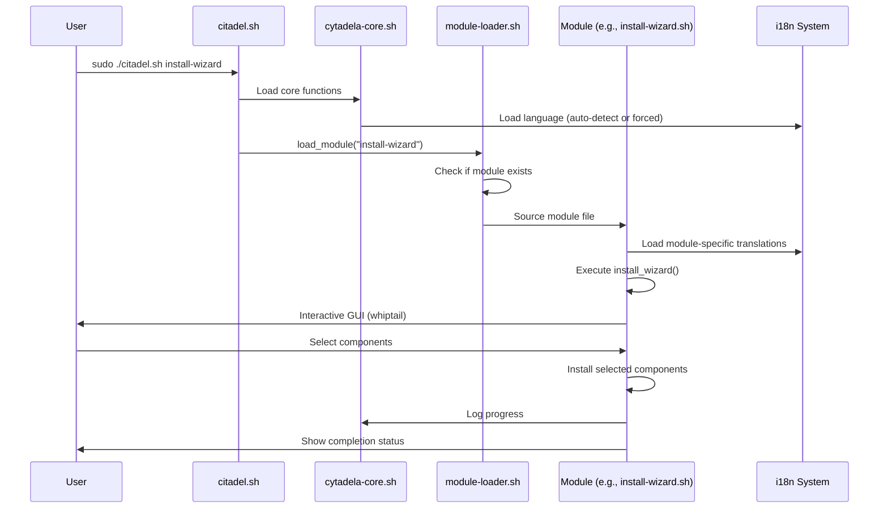
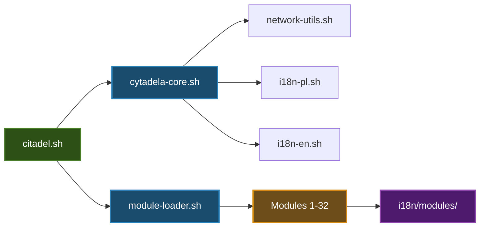

# 🏗️ CITADEL - STRUKTURA PROJEKTU

**Wersja:** 3.1.0  
**Data:** 2026-01-31  
**Format:** Mermaid (łatwy do edycji)

---

## 📊 SCHEMAT BLOKOWY STRUKTURY

```mermaid
graph TB
    subgraph "🎯 ENTRY POINTS"
        MAIN[citadel.sh<br/>Main Script<br/>7KB]
        MAIN_EN[citadel_en.sh<br/>English Wrapper<br/>5KB]
    end

    subgraph "📚 CORE LIBRARIES"
        CORE[cytadela-core.sh<br/>Core Functions<br/>Logging, Error Handling]
        LOADER[module-loader.sh<br/>Lazy Loading<br/>Dynamic Module Discovery]
        NETWORK[network-utils.sh<br/>Network Functions<br/>Interface Detection]
        I18N_PL[i18n-pl.sh<br/>Polish Messages]
        I18N_EN[i18n-en.sh<br/>English Messages]
    end

    subgraph "🔧 FUNCTIONAL MODULES (32)"
        subgraph "Installation"
            M1[install-wizard.sh<br/>Interactive Installer<br/>7 languages]
            M2[install-all.sh<br/>Full Installation]
            M3[install-dnscrypt.sh<br/>DNSCrypt-Proxy]
            M4[install-coredns.sh<br/>CoreDNS]
            M5[install-nftables.sh<br/>NFTables Firewall]
            M6[install-dashboard.sh<br/>Terminal Dashboard]
        end

        subgraph "Configuration"
            M7[configure.sh<br/>System Configuration]
            M8[fix-ports.sh<br/>Port Conflict Resolution]
            M9[edit-tools.sh<br/>Config Editing]
        end

        subgraph "Ad Blocking"
            M10[adblock.sh<br/>Ad Blocking Core]
            M11[blocklist-manager.sh<br/>Multi-blocklist<br/>6 profiles]
        end

        subgraph "Security"
            M12[emergency.sh<br/>Killswitch<br/>Panic Mode]
            M13[supply-chain.sh<br/>Binary Verification]
            M14[integrity.sh<br/>Integrity Check]
            M15[ghost-check.sh<br/>Port Audit]
        end

        subgraph "IPv6 & Network"
            M16[ipv6.sh<br/>IPv6 Privacy<br/>Deep Reset]
            M17[location.sh<br/>Location-aware<br/>SSID-based]
        end

        subgraph "Monitoring"
            M18[health.sh<br/>Health Watchdog]
            M19[diagnostics.sh<br/>Full Diagnostics]
            M20[discover.sh<br/>Network Discovery]
            M21[cache-stats.sh<br/>Cache Statistics]
        end

        subgraph "Automation"
            M22[auto-update.sh<br/>Auto-update Blocklist]
            M23[config-backup.sh<br/>Backup/Restore]
            M24[lkg.sh<br/>Last-Known-Good]
        end

        subgraph "Advanced"
            M25[advanced-install.sh<br/>Kernel Optimization<br/>DoH Parallel]
            M26[test-tools.sh<br/>Safe Test<br/>DNS Test]
            M27[notify.sh<br/>Desktop Notifications]
            M28[nft-debug.sh<br/>NFTables Debug]
        end
    end

    subgraph "🌍 INTERNATIONALIZATION"
        I18N_DIR[lib/i18n/<br/>7 Languages]
        I18N_DE[de.sh - German]
        I18N_ES[es.sh - Spanish]
        I18N_IT[it.sh - Italian]
        I18N_FR[fr.sh - French]
        I18N_RU[ru.sh - Russian]
        I18N_COMMON[common/ - Shared Messages]
        I18N_MODULES[Module-specific translations]
    end

    subgraph "📖 DOCUMENTATION"
        DOC_USER[docs/user/<br/>User Documentation]
        DOC_DEV[docs/developer/<br/>Developer Documentation]
        DOC_ROADMAP[docs/roadmap/<br/>Roadmap & Issues]
        DOC_COMPARISON[docs/comparison/<br/>vs Competitors]
        
        DOC_MANUAL_PL[MANUAL_PL.md<br/>1621 lines]
        DOC_MANUAL_EN[MANUAL_EN.md<br/>Complete English]
        DOC_QUICK[quick-start.md]
        DOC_COMMANDS[commands.md<br/>101 commands]
        DOC_ARCH[architecture.md]
        DOC_CONTRIB[contributing.md]
    end

    subgraph "🗂️ LEGACY (v3.0)"
        LEGACY_PL[legacy/cytadela++.sh<br/>Monolithic v3.0<br/>128KB]
        LEGACY_EN[legacy/citadela_en.sh<br/>Monolithic v3.0<br/>123KB]
        LEGACY_DOCS[legacy/docs/<br/>Legacy Documentation]
    end

    subgraph "🧪 TESTING"
        TEST1[tests/test-core-libs.sh]
        TEST2[tests/test-citadel.sh]
        TEST3[tests/test-integrity-module.sh]
        TEST4[tests/test-smoke.sh]
    end

    %% Connections - Entry Points
    MAIN --> CORE
    MAIN --> LOADER
    MAIN_EN --> CORE
    MAIN_EN --> LOADER

    %% Connections - Core to Modules
    LOADER --> M1
    LOADER --> M2
    LOADER --> M3
    LOADER --> M10
    LOADER --> M12
    LOADER --> M16
    LOADER --> M18
    LOADER --> M22

    %% Connections - Core Libraries
    CORE --> NETWORK
    CORE --> I18N_PL
    CORE --> I18N_EN

    %% Connections - i18n
    I18N_DIR --> I18N_DE
    I18N_DIR --> I18N_ES
    I18N_DIR --> I18N_IT
    I18N_DIR --> I18N_FR
    I18N_DIR --> I18N_RU
    I18N_DIR --> I18N_COMMON
    I18N_DIR --> I18N_MODULES

    %% Connections - Documentation
    DOC_USER --> DOC_MANUAL_PL
    DOC_USER --> DOC_MANUAL_EN
    DOC_USER --> DOC_QUICK
    DOC_USER --> DOC_COMMANDS
    DOC_DEV --> DOC_ARCH
    DOC_DEV --> DOC_CONTRIB

    %% Styling
    classDef entryClass fill:#2d5016,stroke:#4a7c2c,stroke-width:2px,color:#fff
    classDef coreClass fill:#1a4d6d,stroke:#2980b9,stroke-width:2px,color:#fff
    classDef moduleClass fill:#6d4d1a,stroke:#d68910,stroke-width:2px,color:#fff
    classDef i18nClass fill:#4d1a6d,stroke:#8e44ad,stroke-width:2px,color:#fff
    classDef docClass fill:#1a6d4d,stroke:#27ae60,stroke-width:2px,color:#fff
    classDef legacyClass fill:#6d1a1a,stroke:#c0392b,stroke-width:2px,color:#fff
    classDef testClass fill:#4d4d1a,stroke:#f39c12,stroke-width:2px,color:#fff

    class MAIN,MAIN_EN entryClass
    class CORE,LOADER,NETWORK,I18N_PL,I18N_EN coreClass
    class M1,M2,M3,M4,M5,M6,M7,M8,M9,M10,M11,M12,M13,M14,M15,M16,M17,M18,M19,M20,M21,M22,M23,M24,M25,M26,M27,M28 moduleClass
    class I18N_DIR,I18N_DE,I18N_ES,I18N_IT,I18N_FR,I18N_RU,I18N_COMMON,I18N_MODULES i18nClass
    class DOC_USER,DOC_DEV,DOC_ROADMAP,DOC_COMPARISON,DOC_MANUAL_PL,DOC_MANUAL_EN,DOC_QUICK,DOC_COMMANDS,DOC_ARCH,DOC_CONTRIB docClass
    class LEGACY_PL,LEGACY_EN,LEGACY_DOCS legacyClass
    class TEST1,TEST2,TEST3,TEST4 testClass
```



---

## 📁 STRUKTURA KATALOGÓW

```
Citadel/
├── citadel.sh                    # 🎯 Main entry point (7KB)
├── citadel_en.sh                 # 🎯 English wrapper (5KB)
├── VERSION                       # Version: 3.1.0
├── LICENSE                       # GPL-3.0
├── CHANGELOG.md
│
├── lib/                          # 📚 CORE LIBRARIES
│   ├── cytadela-core.sh          # Core functions, logging, error handling
│   ├── module-loader.sh          # Lazy loading, dynamic discovery
│   ├── network-utils.sh          # Network functions, interface detection
│   ├── i18n-pl.sh                # Polish messages
│   ├── i18n-en.sh                # English messages
│   ├── test-core.sh              # Core testing functions
│   └── i18n/                     # 🌍 INTERNATIONALIZATION
│       ├── en.sh, pl.sh, de.sh, es.sh, it.sh, fr.sh, ru.sh
│       ├── common/               # Shared messages (en.sh, pl.sh)
│       ├── adblock/              # Adblock module translations
│       ├── diagnostics/          # Diagnostics module translations
│       └── help/                 # Help system translations
│
├── modules/                      # 🔧 FUNCTIONAL MODULES (32)
│   ├── install-wizard.sh         # Interactive installer (7 languages)
│   ├── install-all.sh            # Full installation
│   ├── install-dnscrypt.sh       # DNSCrypt-Proxy installation
│   ├── install-coredns.sh        # CoreDNS installation
│   ├── install-nftables.sh       # NFTables firewall
│   ├── install-dashboard.sh      # Terminal dashboard
│   ├── configure.sh              # System configuration
│   ├── fix-ports.sh              # Port conflict resolution
│   ├── edit-tools.sh             # Config editing (edit, logs)
│   ├── adblock.sh                # Ad blocking core
│   ├── blocklist-manager.sh      # Multi-blocklist (6 profiles)
│   ├── emergency.sh              # Killswitch, panic mode
│   ├── supply-chain.sh           # Binary verification
│   ├── integrity.sh              # Integrity check
│   ├── ghost-check.sh            # Port audit
│   ├── ipv6.sh                   # IPv6 privacy, deep reset
│   ├── location.sh               # Location-aware, SSID-based
│   ├── health.sh                 # Health watchdog
│   ├── diagnostics.sh            # Full diagnostics
│   ├── discover.sh               # Network discovery
│   ├── cache-stats.sh            # Cache statistics
│   ├── auto-update.sh            # Auto-update blocklist
│   ├── config-backup.sh          # Backup/restore
│   ├── lkg.sh                    # Last-known-good
│   ├── advanced-install.sh       # Kernel optimization, DoH parallel
│   ├── test-tools.sh             # Safe test, DNS test
│   ├── notify.sh                 # Desktop notifications
│   ├── nft-debug.sh              # NFTables debug
│   ├── check-dependencies.sh     # Dependency checker
│   ├── restore.sh                # System restore
│   └── verify.sh                 # Installation verification
│
├── docs/                         # 📖 DOCUMENTATION
│   ├── README.md                 # Documentation index
│   ├── user/                     # User documentation
│   │   ├── MANUAL_PL.md          # 🇵🇱 Complete Polish manual (1621 lines)
│   │   ├── MANUAL_EN.md          # 🇬🇧 Complete English manual
│   │   ├── quick-start.md        # Quick start guide
│   │   ├── commands.md           # 101 commands reference
│   │   ├── configuration.md      # Configuration guide
│   │   ├── troubleshooting.md    # Troubleshooting guide
│   │   └── faq.md                # FAQ
│   ├── developer/                # Developer documentation
│   │   ├── architecture.md       # System architecture
│   │   ├── contributing.md       # Contributing guidelines
│   │   ├── testing-strategy.md   # Testing approach
│   │   ├── testing-guide.md      # Testing guide
│   │   └── modules.md            # Module documentation
│   ├── roadmap/                  # Roadmap & planning
│   │   ├── current.md            # v3.1-v3.4 roadmap
│   │   ├── home-users.md         # Home users focus
│   │   ├── future.md             # v4.0+ vision
│   │   ├── ISSUE-26-Parental-Control.md
│   │   ├── ISSUE-27-Full-Auto-Update.md
│   │   └── ISSUE-28-Full-Backup-Restore.md
│   └── comparison/               # Comparisons
│       └── vs-competitors.md     # vs Pi-hole, AdGuard, etc.
│
├── legacy/                       # 🗂️ LEGACY (v3.0)
│   ├── README.md                 # Legacy info
│   ├── cytadela++.sh             # Monolithic v3.0 PL (128KB)
│   ├── citadela_en.sh            # Monolithic v3.0 EN (123KB)
│   └── docs/                     # Legacy documentation
│       ├── NOTES_PL.md
│       ├── NOTES_EN.md
│       ├── MANUAL_PL.md
│       └── MANUAL_EN.md
│
├── tests/                        # 🧪 TESTING
│   ├── test-core-libs.sh         # Core libraries tests
│   ├── test-citadel.sh           # Main script tests
│   ├── test-integrity-module.sh  # Integrity module tests
│   ├── test-poc-wrapper.sh       # POC wrapper tests
│   └── test-smoke.sh             # Smoke tests
│
├── backup/                       # Backup directory
│   └── pre-refactoring/
│
└── .github/                      # GitHub configuration
    ├── ISSUE_TEMPLATE/           # Issue templates
    │   ├── bug_report.md         # Bug report (EN/PL)
    │   ├── feature_request.md    # Feature request (EN/PL)
    │   └── config.yml
    └── workflows/                # CI/CD workflows
        ├── shellcheck.yml
        └── smoke-tests.yml
```

---

## 🔄 PRZEPŁYW WYKONANIA



---

## 📊 STATYSTYKI PROJEKTU

### Kod

| Komponent | Pliki | Linie kodu | Rozmiar |
|-----------|-------|------------|---------|
| **Main Scripts** | 2 | ~300 | 12 KB |
| **Core Libraries** | 7 | ~2,000 | 50 KB |
| **Modules** | 32 | ~8,000 | 200 KB |
| **i18n** | 14 | ~1,500 | 40 KB |
| **Tests** | 5 | ~1,000 | 25 KB |
| **Legacy** | 2 | ~6,000 | 251 KB |
| **TOTAL** | 62 | ~18,800 | ~578 KB |

### Dokumentacja

| Typ | Pliki | Linie | Rozmiar |
|-----|-------|-------|---------|
| **User Docs** | 7 | ~4,000 | 120 KB |
| **Developer Docs** | 5 | ~2,500 | 80 KB |
| **Roadmap** | 6 | ~1,500 | 50 KB |
| **TOTAL** | 18 | ~8,000 | ~250 KB |

---

## 🎯 KLUCZOWE KOMPONENTY

### 1. Entry Points (citadel.sh, citadel_en.sh)
- Parsowanie argumentów
- Ładowanie core libraries
- Routing do odpowiednich modułów
- Obsługa błędów

### 2. Core Libraries (lib/)
- **cytadela-core.sh** - funkcje podstawowe, logowanie, obsługa błędów
- **module-loader.sh** - lazy loading, dynamiczne ładowanie modułów
- **network-utils.sh** - funkcje sieciowe, detekcja interfejsów
- **i18n-*.sh** - system wielojęzyczny

### 3. Functional Modules (modules/)
- **29 modułów** - każdy odpowiedzialny za konkretną funkcjonalność
- **Lazy loading** - ładowane tylko gdy potrzebne
- **Niezależne** - mogą działać osobno

### 4. Internationalization (lib/i18n/)
- **7 języków** - PL, EN, DE, ES, IT, FR, RU
- **Pełne tłumaczenia** - installer, moduły, komunikaty, logi
- **Modułowe** - każdy moduł ma własne tłumaczenia

### 5. Documentation (docs/)
- **User** - dla użytkowników (manuele, quick-start, FAQ)
- **Developer** - dla deweloperów (architektura, contributing)
- **Roadmap** - plany rozwoju (v3.2-v3.5+)

### 6. Legacy (legacy/)
- **v3.0** - monolityczne skrypty (zachowane dla kompatybilności)
- **Dokumentacja** - legacy docs

---

## 🔗 ZALEŻNOŚCI MIĘDZY KOMPONENTAMI



---

## 📝 EDYCJA SCHEMATU

Ten dokument używa **Mermaid** - łatwego do edycji formatu diagramów.

### Jak edytować:

1. **Edytuj tekst** - zmień nazwy, opisy, dodaj nowe komponenty
2. **Dodaj węzły** - `NAZWA[Tekst<br/>Opis]`
3. **Dodaj połączenia** - `A --> B`
4. **Zmień kolory** - `class NAZWA nazwaKlasy`
5. **Podgląd** - GitHub/GitLab automatycznie renderują Mermaid

### Narzędzia online:
- https://mermaid.live/ - edytor online
- https://mermaid-js.github.io/mermaid-live-editor/ - live editor

---

**Dokument wersja:** 1.0  
**Data ostatniej aktualizacji:** 2026-01-31  
**Autor:** Citadel Team
