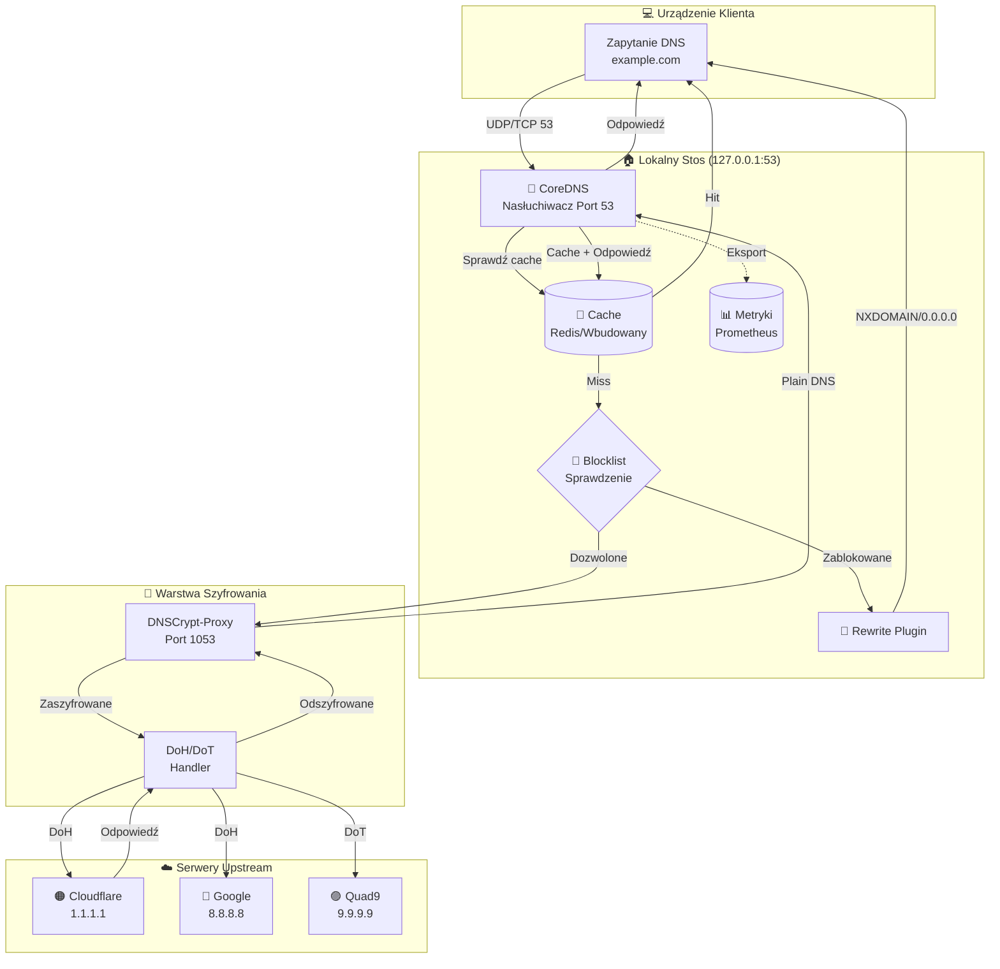

# 🛡️ CITADEL - DOKUMENTACJA SYSTEMU NA ŻYWO

**Diagnostyka w czasie rzeczywistym i przewodnik rozwiązywania problemów dla Citadel DNS Filter**

---

## 📊 Architektura Przepływu Danych

### Kompletna Ścieżka Zapytania (Mermaid)



### Szczegóły Połączenia

| Protokół | Port | Komponent | Szyfrowanie |
|----------|------|-----------|------------|
| DNS | 53 | CoreDNS | Plain (tylko lokalnie) |
| DNSCrypt | 1053 | DNSCrypt-Proxy | DNSCrypt v2 |
| DoH | 443 | DNSCrypt-Proxy | HTTPS |
| DoT | 853 | DNSCrypt-Proxy | TLS 1.3 |
| Metryki | 9153 | CoreDNS | Plain (localhost) |

---

## 🎯 Legenda Statusu Diagnostyki

### Znaczenia Kodów Kolorów

| Status | Kod Koloru | Opis | Wymagane Działanie |
|--------|------------|------|-------------------|
| 🟢 **Doskonały** | `EMR` (Zielony) | Optymalna wydajność, opóźnienie <50ms | Brak - system zdrowy |
| 🟡 **Umiarkowany** | `VIO` (Żółty) | Akceptowalna wydajność, 50-100ms | Monitoruj trendy |
| 🟠 **Ostrzeżenie** | `ORG` (Pomarańczowy) | Pogorszona wydajność, 100-200ms | Zbadaj wkrótce |
| 🔴 **Wysoki** | `RED` (Czerwony) | Słaba wydajność, >200ms lub błędy | Wymagane działanie |
| 🔴 **KRYTYCZNY** | `RED`+Bold | Usługa nie działa lub problem bezpieczeństwa | Napraw natychmiast |

### Tabela Statusu Komponentów

| Komponent | Doskonały | Umiarkowany | Ostrzeżenie | Krytyczny |
|-----------|-----------|-------------|-------------|----------|
| **CoreDNS** | <50ms odpowiedź | 50-100ms | 100-200ms | >200ms/nie działa |
| **DNSCrypt** | <100ms RTT | 100-200ms | 200-500ms | >500ms/nie działa |
| **Cache** | >90% współczynnik trafień | 70-90% | 50-70% | <50% |
| **Blocklist** | <500k domen | 500k-1M | 1M-2M | >2M lub 0 |
| **Pamięć** | <50% użycie | 50-70% | 70-85% | >85% |
| **CPU** | <30% obciążenie | 30-60% | 60-80% | >80% |

---

## 🔧 Przewodnik Rozwiązywania Problemów Oparty na Logach

### Szybki Dostęp do Logów

```bash
# Logi CoreDNS
sudo journalctl -u coredns -f

# Logi DNSCrypt-proxy
sudo journalctl -u dnscrypt-proxy -f

# Wszystkie logi związane z Citadel
sudo ./citadel.sh logs

# Filtrowane logi błędów
sudo ./citadel.sh logs | grep -i error
```

### Częste Problemy i Wzorce Logów

#### Problem 1: Rozwiązywanie DNS Nie Działa

**Objawy:** `dig @127.0.0.1 google.com` przekracza limit czasu

**Sprawdzenie Logów:**
```bash
sudo journalctl -u coredns --since "10 minutes ago"
```

| Wzorzec | Znaczenie | Rozwiązanie |
|---------|-----------|-------------|
| `listen tcp 127.0.0.1:53: bind: address already in use` | Port 53 zajęty | `sudo lsof -i :53` i zabij proces |
| `plugin/errors: 2 google.com. A: unreachable backend` | DNSCrypt nie działa | `sudo systemctl restart dnscrypt-proxy` |
| `plugin/cache: expired` | Problemy z cache | `sudo ./citadel.sh cache-stats-reset` |
| `no healthy upstream` | Wszystkie serwery DoH nie działają | Sprawdź łączność internetową |

#### Problem 2: Wysokie Opóźnienie

**Objawy:** Zapytania DNS wolne (>200ms)

**Sprawdzenie Logów:**
```bash
sudo journalctl -u dnscrypt-proxy --since "1 hour ago" | grep "rtt"
```

| Wzorzec | Znaczenie | Rozwiązanie |
|---------|-----------|-------------|
| `rtt: 500ms+` | Wolny upstream | Zmień serwery w `dnscrypt.toml` |
| `timeout` | Przerywanie połączeń | Sprawdź firewall: `sudo nft list ruleset` |
| `certificate verify failed` | Problem z TLS | Zaktualizuj certyfikaty CA: `sudo update-ca-certificates` |

#### Problem 3: Blocklist Nie Działa

**Objawy:** Reklamy nadal się wyświetlają

**Sprawdzenie Logów:**
```bash
sudo ./citadel.sh adblock-status
sudo cat /var/log/cytadela/blocklist-update.log
```

| Wzorzec | Znaczenie | Rozwiązanie |
|---------|-----------|-------------|
| `0 blocked domains` | Pusta blocklist | `sudo ./citadel.sh lists-update` |
| `download failed: 404` | URL przestarzały | Zaktualizuj URL: `sudo ./citadel.sh blocklist-add-url` |
| `parse error` | Nieprawidłowa lista | Sprawdź format listy (musi być hosts lub plain domains) |

#### Problem 4: Usługa Nie Uruchamia się

**Objawy:** `systemctl status coredns` pokazuje failed

**Sprawdzenie Logów:**
```bash
sudo journalctl -u coredns -b  # Od bootu
sudo ./citadel.sh diagnostics
```

| Wzorzec | Znaczenie | Rozwiązanie |
|---------|-----------|-------------|
| `permission denied` | Złe uprawnienia | `sudo chown -R cytadela:cytadela /opt/cytadela` |
| `config parse error` | Nieprawidłowy Corefile | `sudo ./citadel.sh config-backup` następnie sprawdź składnię |
| `plugin not found` | Brakujący plugin | Przeinstaluj: `sudo ./citadel.sh install-coredns` |
| `module integrity fail` | Uszkodzone pliki | `sudo ./citadel.sh integrity --fix` |

#### Problem 5: Wyciek Pamięci

**Objawy:** Użycie RAM ciągle rośnie

**Sprawdzenie Logów:**
```bash
sudo ./citadel.sh health-status
sudo ps aux | grep -E "coredns|dnscrypt"
```

| Wzorzec | Znaczenie | Rozwiązanie |
|---------|-----------|-------------|
| `RSS >500MB` | Cache zbyt duży | Zmniejsz rozmiar cache w Corefile |
| `goroutine leak` | Błąd pluginu | Zaktualizuj wersję CoreDNS |
| `connection pool full` | Zbyt wielu klientów | Zwiększ limity w konfiguracji |

---

## 📈 Polecenia Monitorowania w Czasie Rzeczywistym

```bash
# Dashboard na żywo
citadel-top

# Szybkie sprawdzenie zdrowia
sudo ./citadel.sh health-status

# Pełna diagnostyka
sudo ./citadel.sh diagnostics

# Benchmark wydajności
sudo ./citadel.sh benchmark

# Śledź cache w czasie rzeczywistym
sudo ./citadel.sh cache-stats-watch
```

---

## 🆘 Procedury Awaryjne

### Kompletna Awaria DNS

```bash
# 1. Przełącz tymczasowo na backup DNS
echo "nameserver 1.1.1.1" | sudo tee /etc/resolv.conf

# 2. Zdiagnozuj problem
sudo ./citadel.sh diagnostics

# 3. Restartuj wszystkie usługi
sudo ./citadel.sh restart

# 4. Zweryfikuj naprawę
dig @127.0.0.1 google.com

# 5. Przywróć lokalny DNS
echo "nameserver 127.0.0.1" | sudo tee /etc/resolv.conf
```

### Odpowiedź na Incydent Bezpieczeństwa

| Wskaźnik | Natychmiastowe Działanie | Śledztwo |
|----------|-------------------------|----------|
| Nieoczekiwany wychodzący DNS | Włącz tryb awaryjny: `sudo ./citadel.sh emergency-enable` | Sprawdź logi pod kątem domen C2 |
| Próby ominięcia blocklist | Przeładuj blocklist: `sudo ./citadel.sh lists-update` | Przejrzyj niestandardową allowlist |
| Nietypowe wzorce zapytań | Włącz logowanie zapytań | Przeanalizuj z `sudo ./citadel.sh cache-stats-top` |

---

## 🔗 Powiązana Dokumentacja

- [Pełny Manual (EN)](docs/user/MANUAL_EN.md)
- [Pełny Manual (PL)](docs/user/MANUAL_PL.md)
- [Referencja Poleceń](docs/user/commands.md)
- [FAQ](docs/user/FAQ.md)

---

**Wersja:** 3.1.1 | **Zaktualizowano:** Na żywo
