```mermaid
graph TD
    subgraph "Core Libraries"
        CORE[cytadela-core.sh]
        LOADER[module-loader.sh]
        NETWORK[network-utils.sh]
        I18N[i18n-*.sh]
    end

    subgraph "Installation"
        WIZARD[install-wizard]
        IALL[install-all]
        IDNS[install-dnscrypt]
        ICORE[install-coredns]
        INFT[install-nftables]
    end

    subgraph "Configuration"
        CONF[configure]
        PORTS[fix-ports]
        EDIT[edit-tools]
    end

    subgraph "Ad Blocking"
        ADBLOCK[adblock]
        BLOCKLIST[blocklist-manager]
    end

    subgraph "Security"
        EMERG[emergency]
        SUPPLY[supply-chain]
        INTEG[integrity]
        GHOST[ghost-check]
    end

    subgraph "Automation"
        AUTO[auto-update]
        BACKUP[config-backup]
        LKG[lkg]
    end

    subgraph "Monitoring"
        HEALTH[health]
        DIAG[diagnostics]
        DISCOVER[discover]
        CACHE[cache-stats]
    end

    %% Core dependencies
    WIZARD --> CORE
    WIZARD --> LOADER
    WIZARD --> I18N

    %% Installation flow
    WIZARD --> IDNS
    WIZARD --> ICORE
    WIZARD --> INFT
    WIZARD --> CONF

    IALL --> IDNS
    IALL --> ICORE
    IALL --> INFT
    IALL --> CONF

    %% Configuration dependencies
    CONF --> NETWORK
    CONF --> DISCOVER
    PORTS --> NETWORK

    %% Ad blocking dependencies
    BLOCKLIST --> ADBLOCK
    BLOCKLIST --> BACKUP
    AUTO --> ADBLOCK
    AUTO --> LKG

    %% Security dependencies
    EMERG --> INFT
    SUPPLY --> INTEG

    %% Monitoring dependencies
    DIAG --> HEALTH
    DIAG --> DISCOVER
    HEALTH --> CACHE

    %% Automation dependencies
    AUTO --> ADBLOCK
    AUTO --> LKG
    BACKUP --> CORE

    style CORE fill:#1a4d6d,stroke:#2980b9,stroke-width:2px,color:#fff
    style LOADER fill:#1a4d6d,stroke:#2980b9,stroke-width:2px,color:#fff
    style NETWORK fill:#1a4d6d,stroke:#2980b9,stroke-width:2px,color:#fff
```

# 🧩 CITADEL - MAPA LOGIKI MODUŁÓW

**Wersja:** 3.1.0
**Data:** 2026-01-31
**Cel:** Planowanie przesunięć funkcji między modułami

---

## 📋 SPIS TREŚCI

1. [Przegląd modułów](#przegląd-modułów)
2. [Szczegółowa mapa funkcji](#szczegółowa-mapa-funkcji)
3. [Zależności między modułami](#zależności-między-modułami)
4. [Sugerowane przesunięcia](#sugerowane-przesunięcia)
5. [Diagram zależności](#diagram-zależności)

---

## 📊 PRZEGLĄD MODUŁÓW

### Kategorie modułów (29 modułów)

| Kategoria | Moduły | Funkcje | Linie kodu |
|-----------|--------|---------|------------|
| **Installation** | 6 | ~25 | ~2000 |
| **Configuration** | 3 | ~12 | ~800 |
| **Ad Blocking** | 2 | ~15 | ~1200 |
| **Security** | 4 | ~20 | ~1500 |
| **IPv6 & Network** | 2 | ~10 | ~600 |
| **Monitoring** | 4 | ~18 | ~1000 |
| **Automation** | 3 | ~12 | ~800 |
| **Advanced** | 4 | ~15 | ~900 |
| **Core Support** | 4 | ~20 | ~1200 |

---

## 🔧 SZCZEGÓŁOWA MAPA FUNKCJI

### 1. MODUŁY INSTALACYJNE

#### `modules/install-wizard.sh` (395 linii)
**Funkcje:**
- `detect_language()` - wykrywa język z $LANG
- `select_language()` - wybór języka (whiptail)
- `install_wizard()` - główny kreator instalacji
- `show_checklist()` - pokazuje checklistę komponentów
- `install_selected_components()` - instaluje wybrane komponenty
- `verify_installation()` - weryfikuje instalację

**Zależności:**
- Core: `log_*`, `check_root`
- i18n: `load_i18n_module()`
- Inne moduły: wywołuje install-dnscrypt, install-coredns, etc.

**Wywołuje:**
- `install_dnscrypt()`
- `install_coredns()`
- `install_nftables()`
- `configure_system()`

---

#### `modules/install-all.sh` (~200 linii)
**Funkcje:**
- `install_all()` - instaluje wszystkie komponenty
- `check_prerequisites()` - sprawdza wymagania
- `install_components_sequence()` - sekwencja instalacji

**Zależności:**
- Wywołuje wszystkie moduły install-*
- Core: `log_*`, `error_handler`

**Kolejność instalacji:**
1. check-dependencies
2. install-dnscrypt
3. install-coredns
4. install-nftables
5. configure-system
6. verify

---

#### `modules/install-dnscrypt.sh` (~300 linii)
**Funkcje:**
- `install_dnscrypt()` - główna instalacja DNSCrypt-Proxy
- `configure_dnscrypt()` - konfiguracja TOML
- `generate_dnscrypt_config()` - generuje config
- `select_dnscrypt_servers()` - wybór serwerów
- `start_dnscrypt_service()` - uruchamia usługę

**Zależności:**
- Core: `log_*`, `check_package`
- Network: `discover_active_interface()`

**Pliki:**
- `/etc/dnscrypt-proxy/dnscrypt-proxy.toml`
- `/etc/systemd/system/dnscrypt-proxy.service`

---

#### `modules/install-coredns.sh` (~350 linii)
**Funkcje:**
- `install_coredns()` - główna instalacja CoreDNS
- `configure_coredns()` - konfiguracja Corefile
- `generate_corefile()` - generuje Corefile
- `setup_zones()` - konfiguruje zones
- `start_coredns_service()` - uruchamia usługę

**Zależności:**
- Core: `log_*`, `check_package`
- Adblock: `download_blocklists()`

**Pliki:**
- `/etc/coredns/Corefile`
- `/etc/coredns/zones/`
- `/etc/systemd/system/coredns.service`

---

#### `modules/install-nftables.sh` (~400 linii)
**Funkcje:**
- `install_nftables()` - główna instalacja NFTables
- `configure_nftables()` - konfiguracja firewall
- `generate_nft_rules()` - generuje reguły
- `apply_nft_rules()` - aplikuje reguły
- `firewall_safe()` - tryb bezpieczny
- `firewall_strict()` - tryb restrykcyjny

**Zależności:**
- Core: `log_*`, `check_package`
- Network: `discover_active_interface()`

**Pliki:**
- `/etc/nftables.conf`
- `/etc/citadel/nftables-rules.nft`

---

#### `modules/install-dashboard.sh` (96 linii)
**Funkcje:**
- `install_citadel_top()` - instaluje terminal dashboard
- `generate_dashboard_script()` - generuje skrypt
- `setup_dashboard_systemd()` - konfiguruje systemd (opcjonalnie)

**Zależności:**
- Core: `log_*`
- Monitoring: `get_prometheus_metrics()`

**Pliki:**
- `/usr/local/bin/citadel-top`

---

### 2. MODUŁY KONFIGURACYJNE

#### `modules/configure.sh` (~250 linii)
**Funkcje:**
- `configure_system()` - główna konfiguracja systemu
- `backup_resolv_conf()` - backup /etc/resolv.conf
- `update_resolv_conf()` - aktualizuje resolv.conf
- `lock_resolv_conf()` - blokuje zmiany (chattr +i)
- `configure_networkmanager()` - konfiguruje NM
- `restore_system()` - przywraca oryginalną konfigurację

**Zależności:**
- Core: `log_*`, `backup_file()`
- Network: `discover_network_stack()`

**Pliki:**
- `/etc/resolv.conf`
- `/etc/NetworkManager/conf.d/citadel-dns.conf`

---

#### `modules/fix-ports.sh` (32 linie)
**Funkcje:**
- `fix_port_conflicts()` - rozwiązuje konflikty portów
- `detect_port_usage()` - wykrywa co używa portu
- `stop_conflicting_services()` - zatrzymuje konfliktujące usługi
- `suggest_port_change()` - sugeruje zmianę portu

**Zależności:**
- Core: `log_*`
- Network: `check_port_usage()`

**Konflikty:**
- Port 53: systemd-resolved, avahi-daemon, dnsmasq
- Port 5355: systemd-resolved

---

#### `modules/edit-tools.sh` (55 linii)
**Funkcje:**
- `edit_config()` - edytuje /etc/coredns/Corefile
- `edit_dnscrypt()` - edytuje dnscrypt-proxy.toml
- `show_logs()` - pokazuje logi (journalctl)

**Zależności:**
- Core: `log_*`, `check_editor()`

**Edytor:**
- $EDITOR (domyślnie: nano)

---

### 3. MODUŁY BLOKOWANIA REKLAM

#### `modules/adblock.sh` (~500 linii)
**Funkcje:**
- `adblock_status()` - status blokowania
- `adblock_stats()` - statystyki
- `adblock_add()` - dodaje domenę do blokady
- `adblock_remove()` - usuwa domenę z blokady
- `adblock_query()` - sprawdza czy domena jest zablokowana
- `adblock_show()` - pokazuje listę (custom/blocklist/combined)
- `adblock_rebuild()` - przebudowuje listy
- `download_blocklists()` - pobiera listy z internetu
- `merge_blocklists()` - łączy listy
- `apply_allowlist()` - aplikuje allowlist

**Zależności:**
- Core: `log_*`, `download_file()`
- LKG: `lkg_save()`, `lkg_restore()`

**Pliki:**
- `/etc/coredns/zones/blocklist.hosts`
- `/etc/coredns/zones/custom.hosts`
- `/etc/coredns/zones/combined.hosts`
- `/etc/coredns/zones/allowlist.txt`

**Źródła list:**
- Hagezi Pro
- OISD
- StevenBlack
- Polish filters (opcjonalnie)

---

#### `modules/blocklist-manager.sh` (~400 linii)
**Funkcje:**
- `blocklist_list()` - lista dostępnych profili
- `blocklist_switch()` - przełącza profil
- `blocklist_status()` - aktualny profil
- `blocklist_add_url()` - dodaje własny URL
- `blocklist_remove_url()` - usuwa URL
- `blocklist_show_urls()` - pokazuje URLs

**Profile:**
- `minimal` - ~50K domen
- `standard` - ~325K domen (domyślny)
- `aggressive` - ~1M+ domen
- `privacy` - fokus na prywatność
- `polish` - polskie filtry
- `custom` - własne URLs

**Zależności:**
- Core: `log_*`
- Adblock: `adblock_rebuild()`
- Config-backup: `config_backup()`

**Pliki:**
- `/etc/citadel/blocklist-profile.conf`
- `/etc/citadel/blocklist-urls.txt`

---

### 4. MODUŁY BEZPIECZEŃSTWA

#### `modules/emergency.sh` (~150 linii)
**Funkcje:**
- `emergency_killswitch_on()` - włącza killswitch
- `emergency_killswitch_off()` - wyłącza killswitch
- `killswitch_on()` - alias
- `killswitch_off()` - alias
- `emergency_refuse()` - blokuje wszystkie zapytania DNS
- `emergency_restore()` - przywraca normalną pracę
- `panic_bypass()` - tryb awaryjny (flush nft + public DNS)
- `panic_restore()` - przywraca z panic mode
- `panic_status()` - status panic mode

**Zależności:**
- Core: `log_*`
- NFTables: `nft_flush()`, `nft_restore()`

**Pliki:**
- `/etc/citadel/panic-backup.nft`
- `/etc/citadel/panic-resolv.conf.backup`

---

#### `modules/supply-chain.sh` (~300 linii)
**Funkcje:**
- `supply_chain_init()` - inicjalizuje sumy kontrolne
- `supply_chain_verify()` - weryfikuje integralność
- `supply_chain_status()` - status weryfikacji
- `generate_checksums()` - generuje SHA256
- `verify_checksums()` - weryfikuje SHA256
- `check_binary_integrity()` - sprawdza binaria

**Zależności:**
- Core: `log_*`, `calculate_sha256()`

**Pliki:**
- `/var/lib/citadel/supply-chain/checksums.txt`
- `/var/lib/citadel/supply-chain/manifest.json`

**Weryfikowane:**
- `/usr/bin/dnscrypt-proxy`
- `/usr/bin/coredns`
- `/opt/citadel/modules/*.sh`

---

#### `modules/integrity.sh` (~250 linii)
**Funkcje:**
- `integrity_init()` - inicjalizuje manifest
- `integrity_check()` - sprawdza integralność
- `integrity_status()` - status integralności
- `generate_manifest()` - generuje manifest
- `verify_manifest()` - weryfikuje manifest
- `detect_modifications()` - wykrywa modyfikacje

**Zależności:**
- Core: `log_*`, `calculate_sha256()`

**Pliki:**
- `/var/lib/citadel/integrity/manifest.json`
- `/var/lib/citadel/integrity/baseline.json`

---

#### `modules/ghost-check.sh` (~200 linii)
**Funkcje:**
- `ghost_check()` - audyt otwartych portów
- `scan_open_ports()` - skanuje porty (ss/netstat)
- `check_unexpected_ports()` - sprawdza nieoczekiwane porty
- `list_listening_services()` - lista usług nasłuchujących
- `warn_suspicious_ports()` - ostrzega o podejrzanych portach

**Zależności:**
- Core: `log_*`
- Network: `get_listening_ports()`

**Oczekiwane porty:**
- 22 (SSH)
- 53 (DNS - localhost only)
- 5355 (DNSCrypt - localhost only)

---

### 5. MODUŁY IPv6 i SIECI

#### `modules/ipv6.sh` (~186 linii)
**Funkcje:**
- `ipv6_privacy_on()` - włącza prywatność IPv6
- `ipv6_privacy_off()` - wyłącza prywatność
- `ipv6_privacy_status()` - status prywatności
- `ipv6_privacy_auto()` - auto-ensure prywatności
- `ipv6_deep_reset()` - głęboki reset IPv6
- `smart_ipv6_detection()` - smart detection
- `smart_ipv6()` - alias
- `check_temporary_addresses()` - sprawdza temp adresy
- `enable_privacy_extensions()` - włącza rozszerzenia

**Zależności:**
- Core: `log_*`
- Network: `discover_active_interface()`

**Sysctl:**
- `net.ipv6.conf.*.use_tempaddr = 2`
- `net.ipv6.conf.*.temp_prefered_lft = 86400`
- `net.ipv6.conf.*.temp_valid_lft = 604800`

---

#### `modules/location.sh` (~250 linii)
**Funkcje:**
- `location_status()` - status lokalizacji
- `location_check()` - sprawdza lokalizację i doradza
- `location_add_trusted()` - dodaje zaufany SSID
- `location_remove_trusted()` - usuwa SSID
- `location_list_trusted()` - lista zaufanych SSID
- `get_current_ssid()` - pobiera aktualny SSID
- `is_trusted_network()` - sprawdza czy sieć jest zaufana

**Zależności:**
- Core: `log_*`
- Network: `get_wifi_ssid()`

**Pliki:**
- `/etc/citadel/trusted-ssids.txt`

**Use case:**
- Ostrzega gdy jesteś w niezaufanej sieci
- Sugeruje włączenie strict firewall

---

### 6. MODUŁY MONITOROWANIA

#### `modules/health.sh` (~300 linii)
**Funkcje:**
- `health_install()` - instaluje health watchdog
- `health_status()` - status zdrowia systemu
- `health_check()` - sprawdza zdrowie
- `check_service_health()` - sprawdza usługi
- `check_dns_resolution()` - sprawdza rozwiązywanie DNS
- `check_connectivity()` - sprawdza łączność
- `auto_restart_failed_services()` - auto-restart

**Zależności:**
- Core: `log_*`
- Notify: `send_notification()`

**Systemd:**
- `/etc/systemd/system/citadel-health.service`
- `/etc/systemd/system/citadel-health.timer`

**Sprawdza:**
- DNSCrypt-Proxy status
- CoreDNS status
- NFTables status
- DNS resolution (1.1.1.1, google.com)
- Connectivity (ping 1.1.1.1)

---

#### `modules/diagnostics.sh` (~400 linii)
**Funkcje:**
- `diagnostics()` - pełna diagnostyka
- `check_services()` - sprawdza usługi
- `check_dns_config()` - sprawdza konfigurację DNS
- `check_firewall()` - sprawdza firewall
- `check_dns_resolution()` - sprawdza rozwiązywanie
- `check_dns_encryption()` - sprawdza szyfrowanie
- `check_dns_leaks()` - sprawdza wycieki
- `generate_diagnostic_report()` - generuje raport

**Zależności:**
- Core: `log_*`
- Network: `discover_network_stack()`
- Health: `health_check()`

**Raport:**
- Service status
- DNS configuration
- Firewall rules
- Resolution tests
- Encryption tests
- Leak tests
- Recommendations

---

#### `modules/discover.sh` (~200 linii)
**Funkcje:**
- `discover()` - network & firewall snapshot
- `discover_active_interface()` - wykrywa aktywny interfejs
- `discover_network_stack()` - wykrywa network manager
- `discover_dns_servers()` - wykrywa serwery DNS
- `discover_firewall_rules()` - pokazuje reguły firewall
- `discover_routing()` - pokazuje routing

**Zależności:**
- Core: `log_*`

**Wykrywa:**
- Active interface (eth0, wlan0, etc.)
- Network manager (NetworkManager, systemd-networkd, none)
- DNS servers (z /etc/resolv.conf)
- Firewall (nftables, iptables, ufw)
- Default gateway
- IPv4/IPv6 addresses

---

#### `modules/cache-stats.sh` (~250 linii)
**Funkcje:**
- `cache_stats()` - statystyki cache
- `cache_stats_top()` - top domeny
- `cache_stats_reset()` - reset statystyk
- `cache_stats_watch()` - live monitoring
- `get_prometheus_metrics()` - pobiera metryki z Prometheus
- `calculate_hit_rate()` - oblicza hit rate
- `show_top_domains()` - pokazuje top domeny

**Zależności:**
- Core: `log_*`
- Prometheus: `curl http://127.0.0.1:9153/metrics`

**Metryki:**
- `coredns_dns_request_count_total`
- `coredns_cache_hits_total`
- `coredns_cache_misses_total`
- `coredns_dns_request_duration_seconds`

---

### 7. MODUŁY AUTOMATYZACJI

#### `modules/auto-update.sh` (~350 linii)
**Funkcje:**
- `auto_update_enable()` - włącza auto-update
- `auto_update_disable()` - wyłącza auto-update
- `auto_update_status()` - status auto-update
- `auto_update_now()` - aktualizuje teraz
- `auto_update_configure()` - konfiguruje ustawienia
- `setup_auto_update_timer()` - konfiguruje systemd timer
- `run_auto_update()` - uruchamia aktualizację

**Zależności:**
- Core: `log_*`
- Adblock: `download_blocklists()`, `adblock_rebuild()`
- LKG: `lkg_save()`, `lkg_restore()`
- Notify: `send_notification()`

**Systemd:**
- `/etc/systemd/system/citadel-auto-update.service`
- `/etc/systemd/system/citadel-auto-update.timer`

**Konfiguracja:**
- Częstotliwość: daily/weekly
- Godzina: 03:00 (domyślnie)
- LKG fallback: włączony

---

#### `modules/config-backup.sh` (~300 linii)
**Funkcje:**
- `config_backup()` - backup konfiguracji
- `config_restore()` - przywraca z backupu
- `config_list()` - lista backupów
- `config_delete()` - usuwa backup
- `create_backup_archive()` - tworzy tar.gz
- `extract_backup_archive()` - wypakowuje tar.gz
- `verify_backup()` - weryfikuje backup

**Zależności:**
- Core: `log_*`, `create_archive()`, `extract_archive()`

**Backup zawiera:**
- `/etc/dnscrypt-proxy/dnscrypt-proxy.toml`
- `/etc/coredns/Corefile`
- `/etc/coredns/zones/`
- `/etc/citadel/`
- NFTables rules

**Lokalizacja:**
- `/var/lib/citadel/backups/citadel-backup-YYYYMMDD-HHMMSS.tar.gz`

---

#### `modules/lkg.sh` (~200 linii)
**Funkcje:**
- `lkg_save()` - zapisuje last-known-good
- `lkg_restore()` - przywraca LKG
- `lkg_status()` - status LKG
- `lkg_list()` - lista LKG cache
- `lkg_cleanup()` - czyści stare LKG

**Zależności:**
- Core: `log_*`

**Pliki:**
- `/var/lib/citadel/lkg/blocklist.hosts`
- `/var/lib/citadel/lkg/combined.hosts`
- `/var/lib/citadel/lkg/metadata.json`

**Use case:**
- Przed aktualizacją blocklist → lkg_save()
- Jeśli aktualizacja fail → lkg_restore()

---

### 8. MODUŁY ZAAWANSOWANE

#### `modules/advanced-install.sh` (175 linii)
**Funkcje:**
- `optimize_kernel_priority()` - optymalizuje priorytety kernela
- `install_doh_parallel()` - instaluje DoH parallel racing
- `install_editor_integration()` - integracja z edytorem

**Zależności:**
- Core: `log_*`

**Optymalizacje:**
- Nice priority dla CoreDNS (-10)
- IO priority (best-effort, priority 0)
- CPU affinity (opcjonalnie)

---

#### `modules/test-tools.sh` (64 linie)
**Funkcje:**
- `safe_test_mode()` - bezpieczny tryb testowy
- `test_dns()` - test DNS resolution

**Zależności:**
- Core: `log_*`
- Diagnostics: `check_dns_resolution()`

**Testy:**
- Resolution test (google.com, 1.1.1.1)
- Encryption test (DNSCrypt active?)
- Leak test (tylko localhost?)

---

#### `modules/notify.sh` (~150 linii)
**Funkcje:**
- `notify_enable()` - włącza powiadomienia
- `notify_disable()` - wyłącza powiadomienia
- `notify_status()` - status powiadomień
- `notify_test()` - test powiadomienia
- `send_notification()` - wysyła powiadomienie (libnotify)

**Zależności:**
- Core: `log_*`

**Wymagania:**
- `notify-send` (libnotify)
- X11 session lub Wayland

**Use case:**
- Auto-update completed
- Service failed
- DNS leak detected
- Health check failed

---

#### `modules/nft-debug.sh` (~200 linii)
**Funkcje:**
- `nft_debug_on()` - włącza debug NFTables
- `nft_debug_off()` - wyłącza debug
- `nft_debug_status()` - status debug
- `nft_debug_logs()` - pokazuje logi debug
- `add_nft_debug_chain()` - dodaje debug chain
- `remove_nft_debug_chain()` - usuwa debug chain

**Zależności:**
- Core: `log_*`
- NFTables: `nft_reload()`

**Debug chain:**
- Rate-limited logging (10/minute)
- Counters dla każdej reguły
- Log do systemd journal

---

### 9. MODUŁY WSPARCIA RDZENIA

#### `modules/check-dependencies.sh` (~250 linii)
**Funkcje:**
- `check_deps()` - sprawdza zależności
- `check_package()` - sprawdza czy pakiet jest zainstalowany
- `install_missing_deps()` - instaluje brakujące zależności
- `list_missing_deps()` - lista brakujących pakietów

**Zależności:**
- Core: `log_*`

**Wymagane pakiety:**
- dnscrypt-proxy
- coredns
- nftables
- curl
- jq
- dig (bind-tools)
- whiptail (libnewt)

---

#### `modules/restore.sh` (~150 linii)
**Funkcje:**
- `restore_system()` - przywraca oryginalną konfigurację
- `restore_resolv_conf()` - przywraca resolv.conf
- `restore_networkmanager()` - przywraca NM config
- `stop_citadel_services()` - zatrzymuje usługi Citadel

**Zależności:**
- Core: `log_*`
- Configure: `backup_resolv_conf()`

---

#### `modules/verify.sh` (~200 linii)
**Funkcje:**
- `verify()` - weryfikuje pełną instalację
- `verify_services()` - weryfikuje usługi
- `verify_dns_resolution()` - weryfikuje rozwiązywanie
- `verify_encryption()` - weryfikuje szyfrowanie
- `verify_firewall()` - weryfikuje firewall

**Zależności:**
- Core: `log_*`
- Diagnostics: `diagnostics()`
- Health: `health_check()`

---

## 🔗 ZALEŻNOŚCI MIĘDZY MODUŁAMI



---

## 💡 SUGEROWANE PRZESUNIĘCIA FUNKCJI

### 1. Konsolidacja funkcji sieciowych

**Problem:** Funkcje sieciowe rozproszone w wielu modułach

**Sugerowane przesunięcie:**
```
discover.sh:discover_active_interface() → network-utils.sh
discover.sh:discover_network_stack() → network-utils.sh
ipv6.sh:check_temporary_addresses() → network-utils.sh
location.sh:get_current_ssid() → network-utils.sh
```

**Korzyści:**
- Jedna biblioteka dla wszystkich funkcji sieciowych
- Łatwiejsze testowanie
- Mniej duplikacji kodu

---

### 2. Konsolidacja funkcji weryfikacji

**Problem:** Weryfikacja rozproszona

**Sugerowane przesunięcie:**
```
verify.sh:verify_services() → health.sh:check_service_health()
verify.sh:verify_dns_resolution() → diagnostics.sh:check_dns_resolution()
verify.sh:verify_encryption() → diagnostics.sh:check_dns_encryption()
```

**Korzyści:**
- Mniej duplikacji
- Spójne testy w jednym miejscu

---

### 3. Konsolidacja funkcji backup

**Problem:** Backup funkcje w wielu miejscach

**Sugerowane przesunięcie:**
```
configure.sh:backup_resolv_conf() → config-backup.sh:backup_file()
blocklist-manager.sh:backup_before_switch() → config-backup.sh:config_backup()
```

**Korzyści:**
- Jeden moduł odpowiedzialny za backup
- Spójne nazewnictwo
- Łatwiejsze zarządzanie backupami

---

### 4. Wydzielenie funkcji powiadomień

**Problem:** Powiadomienia w wielu modułach

**Sugerowane przesunięcie:**
```
health.sh:send_notification() → notify.sh:send_notification()
auto-update.sh:notify_update_complete() → notify.sh:send_notification()
```

**Korzyści:**
- Centralne zarządzanie powiadomieniami
- Łatwa konfiguracja (enable/disable)
- Spójny format powiadomień

---

### 5. Konsolidacja aliasów

**Problem:** Aliasy funkcji w modułach

**Obecne aliasy:**
```
ipv6.sh:smart_ipv6() → smart_ipv6_detection()
emergency.sh:killswitch_on() → emergency_killswitch_on()
emergency.sh:killswitch_off() → emergency_killswitch_off()
```

**Sugerowane:**
- Przenieść aliasy do cytadela-core.sh
- Lub usunąć aliasy i używać pełnych nazw

---

## 📊 MAPA WYWOŁAŃ FUNKCJI

### Przykład: Instalacja przez wizard

```
User: sudo ./citadel.sh install-wizard
  ↓
citadel.sh
  ↓
load_module("install-wizard")
  ↓
install_wizard()
  ├─ detect_language()
  ├─ select_language()
  ├─ show_checklist()
  ├─ install_selected_components()
  │   ├─ install_dnscrypt()
  │   │   ├─ check_package("dnscrypt-proxy")
  │   │   ├─ configure_dnscrypt()
  │   │   └─ start_dnscrypt_service()
  │   ├─ install_coredns()
  │   │   ├─ check_package("coredns")
  │   │   ├─ configure_coredns()
  │   │   ├─ download_blocklists()
  │   │   └─ start_coredns_service()
  │   ├─ install_nftables()
  │   │   ├─ check_package("nftables")
  │   │   ├─ generate_nft_rules()
  │   │   └─ apply_nft_rules()
  │   └─ configure_system()
  │       ├─ backup_resolv_conf()
  │       ├─ update_resolv_conf()
  │       └─ lock_resolv_conf()
  └─ verify_installation()
      ├─ verify_services()
      ├─ verify_dns_resolution()
      └─ verify_firewall()
```

---

## 🎯 PLANOWANIE PRZESUNIĘĆ

### Template do planowania:

```markdown
## Przesunięcie: [Nazwa funkcji]

**Z:** modules/[stary-moduł].sh
**Do:** modules/[nowy-moduł].sh lub lib/[biblioteka].sh

**Funkcja:**
- `nazwa_funkcji()` - opis

**Zależności:**
- Funkcja A (pozostaje w starym module)
- Funkcja B (również przenoszona)

**Kroki:**
1. Skopiuj funkcję do nowego modułu
2. Zaktualizuj wywołania w innych modułach
3. Dodaj alias w starym module (dla kompatybilności)
4. Przetestuj
5. Usuń starą funkcję (po okresie przejściowym)

**Ryzyko:** Niskie/Średnie/Wysokie
**Priorytet:** Niski/Średni/Wysoki
```

---

## 📝 NOTATKI DO REFAKTORYZACJI

### Moduły do rozważenia:

1. **Utworzyć nowy moduł: `network-core.sh`**
   - Wszystkie funkcje sieciowe z discover, ipv6, location
   - Część network-utils.sh

2. **Rozszerzyć `config-backup.sh` → `backup-restore.sh`**
   - Wszystkie funkcje backup z różnych modułów
   - Pełny backup/restore (Issue #28)

3. **Rozważyć podział `adblock.sh`**
   - `adblock-core.sh` - podstawowe funkcje
   - `adblock-lists.sh` - zarządzanie listami
   - Może być za dużo, ale warto rozważyć

4. **Utworzyć `notification-manager.sh`**
   - Rozszerzyć notify.sh
   - Centralne zarządzanie wszystkimi powiadomieniami

---

**Dokument wersja:** 1.0
**Data ostatniej aktualizacji:** 2026-01-31
**Autor:** Zespół Citadel

**Użyj tego dokumentu do planowania przesunięć funkcji między modułami!**
