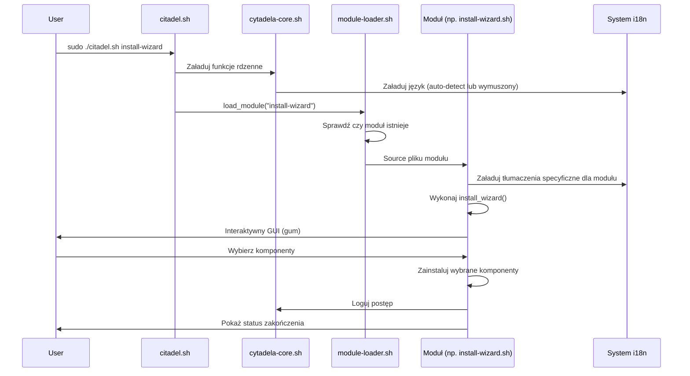
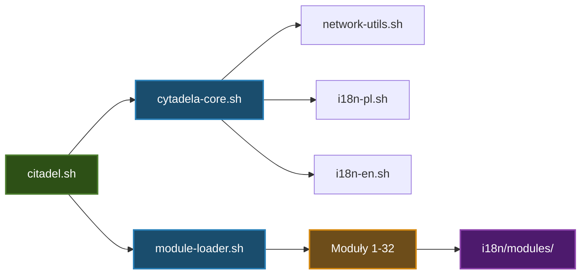

# 🏗️ CITADEL - STRUKTURA PROJEKTU

**Wersja:** 3.1.0
**Data:** 2026-01-31
**Format:** Mermaid (łatwy do edycji)

---

## 📋 AKTUALNA LISTA MODUŁÓW

### 🔧 Instalacja (6)
- `install-wizard.sh` - Interaktywny instalator (7 języków)
- `install-all.sh` - Pełna instalacja
- `install-dnscrypt.sh` - DNSCrypt-Proxy
- `install-coredns.sh` - CoreDNS
- `install-nftables.sh` - Firewall NFTables
- `install-dashboard.sh` - Terminal Dashboard

### ⚙️ Konfiguracja (3)
- `configure.sh` - Konfiguracja systemu
- `fix-ports.sh` - Rozwiązywanie konfliktów portów
- `edit-tools.sh` - Narzędzia edycji

### 🛡️ Bezpieczeństwo (4)
- `emergency.sh` - Killswitch i tryb paniki
- `supply-chain.sh` - Weryfikacja binariów
- `integrity.sh` - Sprawdzenie integralności
- `ghost-check.sh` - Audyt portów

### 🚫 Blokowanie reklam (2)
- `adblock.sh` - Rdzeń blokowania reklam
- `blocklist-manager.sh` - Wieloplikowe listy blokowania (6 profili)

### 🌐 IPv6 i Sieć (2)
- `ipv6.sh` - Prywatność IPv6 i głęboki reset
- `location.sh` - Świadomy lokalizacji (oparty na SSID)

### 📊 Monitorowanie (4)
- `health.sh` - Strażnik zdrowia
- `diagnostics.sh` - Pełna diagnostyka
- `discover.sh` - Odkrywanie sieci
- `cache-stats.sh` - Statystyki cache

### 🔄 Automatyzacja (3)
- `auto-update.sh` - Auto-aktualizacja listy blokowania
- `config-backup.sh` - Kopia zapasowa/przywracanie
- `lkg.sh` - Cache Last-Known-Good

### 🔧 Zaawansowane (2)
- `test-tools.sh` - Bezpieczny test DNS
- `nft-debug.sh` - Debug NFTables

### 🔔 Testowanie (1)
- `test-module.sh` - Pomocnik testowania modułów

---

## 📊 SCHEMAT BLOKOWY STRUKTURY

**Aktualna liczba modułów:** 29

```mermaid
graph TB
    subgraph "🎯 PUNKTY WEJŚCIA"
        MAIN[citadel.sh<br/>Główny skrypt<br/>7KB]
        MAIN_EN[citadel_en.sh<br/>Wrapper angielski<br/>5KB]
    end

    subgraph "📚 BIBLIOTEKI RDZENNE"
        CORE[cytadela-core.sh<br/>Funkcje rdzenne<br/>Logowanie, obsługa błędów]
        LOADER[module-loader.sh<br/>Lazy Loading<br/>Dynamiczne odkrywanie modułów]
        NETWORK[network-utils.sh<br/>Funkcje sieciowe<br/>Detekcja interfejsów]
        I18N_PL[i18n-pl.sh<br/>Wiadomości polskie]
        I18N_EN[i18n-en.sh<br/>Wiadomości angielskie]
    end

    subgraph "🔧 MODUŁY FUNKCJONALNE (29)"
        subgraph "Instalacja"
            M1[install-wizard.sh<br/>Interaktywny instalator<br/>7 języków]
            M2[install-all.sh<br/>Pełna instalacja]
            M3[install-dnscrypt.sh<br/>DNSCrypt-Proxy]
            M4[install-coredns.sh<br/>CoreDNS]
            M5[install-nftables.sh<br/>Firewall NFTables]
            M6[install-dashboard.sh<br/>Terminal Dashboard]
        end

        subgraph "Konfiguracja"
            M7[configure.sh<br/>Konfiguracja systemu]
            M8[fix-ports.sh<br/>Rozwiązywanie konfliktów portów]
            M9[edit-tools.sh<br/>Edycja konfiguracji]
        end

        subgraph "Blokowanie reklam"
            M10[adblock.sh<br/>Rdzeń blokowania reklam]
            M11[blocklist-manager.sh<br/>Wieloplikowe listy<br/>6 profili]
        end

        subgraph "Bezpieczeństwo"
            M12[emergency.sh<br/>Killswitch<br/>Tryb paniki]
            M13[supply-chain.sh<br/>Weryfikacja binariów]
            M14[integrity.sh<br/>Sprawdzenie integralności]
            M15[ghost-check.sh<br/>Audyt portów]
        end

        subgraph "IPv6 i Sieć"
            M16[ipv6.sh<br/>Prywatność IPv6<br/>Głęboki reset]
            M17[location.sh<br/>Świadomy lokalizacji<br/>SSID-based]
        end

        subgraph "Monitorowanie"
            M18[health.sh<br/>Strażnik zdrowia]
            M19[diagnostics.sh<br/>Pełna diagnostyka]
            M20[discover.sh<br/>Odkrywanie sieci]
            M21[cache-stats.sh<br/>Statystyki cache]
        end

        subgraph "Automatyzacja"
            M22[auto-update.sh<br/>Auto-aktualizacja list]
            M23[config-backup.sh<br/>Kopia/przywracanie]
            M24[lkg.sh<br/>Last-Known-Good]
        end

        subgraph "Zaawansowane"
            M25[test-tools.sh<br/>Bezpieczny test<br/>Test DNS]
            M26[nft-debug.sh<br/>Debug NFTables]
        end
    end

    subgraph "🌍 MIĘDZYNARODOWY"
        I18N_DIR[lib/i18n/<br/>7 języków]
        I18N_DE[de.sh - Niemiecki]
        I18N_ES[es.sh - Hiszpański]
        I18N_IT[it.sh - Włoski]
        I18N_FR[fr.sh - Francuski]
        I18N_RU[ru.sh - Rosyjski]
        I18N_COMMON[common/ - Wspólne wiadomości]
        I18N_MODULES[Tłumaczenia specyficzne<br/>dla modułów]
    end

    subgraph "📖 DOKUMENTACJA"
        DOC_USER[docs/user/<br/>Dokumentacja użytkownika]
        DOC_DEV[docs/developer/<br/>Dokumentacja dewelopera]
        DOC_ROADMAP[docs/roadmap/<br/>Roadmap i Issues]
        DOC_COMPARISON[docs/comparison/<br/>vs Konkurencji]

        DOC_MANUAL_PL[MANUAL_PL.md<br/>1621 linii]
        DOC_MANUAL_EN[MANUAL_EN.md<br/>Pełny angielski]
        DOC_QUICK[quick-start.md]
        DOC_COMMANDS[commands.md<br/>101 komend]
        DOC_ARCH[architecture.md]
        DOC_CONTRIB[contributing.md]
    end

    subgraph "🗂️ LEGACY (v3.0)"
        LEGACY_PL[legacy/cytadela++.sh<br/>Monolityczny v3.0<br/>128KB]
        LEGACY_EN[legacy/citadela_en.sh<br/>Monolityczny v3.0<br/>123KB]
        LEGACY_DOCS[legacy/docs/<br/>Dokumentacja legacy]
    end

    subgraph "🧪 TESTOWANIE"
        TEST1[tests/test-core-libs.sh]
        TEST2[tests/test-citadel.sh]
        TEST3[tests/test-integrity-module.sh]
        TEST4[tests/test-smoke.sh]
    end

    %% Połączenia - Punkty wejścia
    MAIN --> CORE
    MAIN --> LOADER
    MAIN_EN --> CORE
    MAIN_EN --> LOADER

    %% Połączenia - Rdzeń do modułów
    LOADER --> M1
    LOADER --> M2
    LOADER --> M3
    LOADER --> M10
    LOADER --> M12
    LOADER --> M16
    LOADER --> M18
    LOADER --> M22

    %% Połączenia - Biblioteki rdzenne
    CORE --> NETWORK
    CORE --> I18N_PL
    CORE --> I18N_EN

    %% Połączenia - i18n
    I18N_DIR --> I18N_DE
    I18N_DIR --> I18N_ES
    I18N_DIR --> I18N_IT
    I18N_DIR --> I18N_FR
    I18N_DIR --> I18N_RU
    I18N_DIR --> I18N_COMMON
    I18N_DIR --> I18N_MODULES

    %% Połączenia - Dokumentacja
    DOC_USER --> DOC_MANUAL_PL
    DOC_USER --> DOC_MANUAL_EN
    DOC_USER --> DOC_QUICK
    DOC_USER --> DOC_COMMANDS
    DOC_DEV --> DOC_ARCH
    DOC_DEV --> DOC_CONTRIB

    %% Styling
    classDef entryClass fill:#2d5016,stroke:#4a7c2c,stroke-width:2px,color:#fff
    classDef coreClass fill:#1a4d6d,stroke:#2980b9,stroke-width:2px,color:#fff
    classDef moduleClass fill:#6d4d1a,stroke:#d68910,stroke-width:2px,color:#fff
    classDef i18nClass fill:#4d1a6d,stroke:#8e44ad,stroke-width:2px,color:#fff
    classDef docClass fill:#1a6d4d,stroke:#27ae60,stroke-width:2px,color:#fff
    classDef legacyClass fill:#6d1a1a,stroke:#c0392b,stroke-width:2px,color:#fff
    classDef testClass fill:#4d4d1a,stroke:#f39c12,stroke-width:2px,color:#fff

    class MAIN,MAIN_EN entryClass
    class CORE,LOADER,NETWORK,I18N_PL,I18N_EN coreClass
    class M1,M2,M3,M4,M5,M6,M7,M8,M9,M10,M11,M12,M13,M14,M15,M16,M17,M18,M19,M20,M21,M22,M23,M24,M25,M26,M27,M28 moduleClass
    class I18N_DIR,I18N_DE,I18N_ES,I18N_IT,I18N_FR,I18N_RU,I18N_COMMON,I18N_MODULES i18nClass
    class DOC_USER,DOC_DEV,DOC_ROADMAP,DOC_COMPARISON,DOC_MANUAL_PL,DOC_MANUAL_EN,DOC_QUICK,DOC_COMMANDS,DOC_ARCH,DOC_CONTRIB docClass
    class LEGACY_PL,LEGACY_EN,LEGACY_DOCS legacyClass
    class TEST1,TEST2,TEST3,TEST4 testClass
```



---

## 📁 STRUKTURA KATALOGÓW

```
Citadel/
├── citadel.sh                    # 🎯 Główny punkt wejścia (7KB)
├── citadel_en.sh                 # 🎯 Wrapper angielski (5KB)
├── VERSION                       # Wersja: 3.1.0
├── LICENSE                       # GPL-3.0
├── CHANGELOG.md
│
├── lib/                          # 📚 BIBLIOTEKI RDZENNE
│   ├── cytadela-core.sh          # Funkcje rdzenne, logowanie, obsługa błędów
│   ├── module-loader.sh          # Lazy loading, dynamiczne odkrywanie
│   ├── network-utils.sh          # Funkcje sieciowe, detekcja interfejsów
│   ├── i18n-pl.sh                # Wiadomości polskie
│   ├── i18n-en.sh                # Wiadomości angielskie
│   ├── test-core.sh              # Funkcje testowe rdzenne
│   └── i18n/                     # 🌍 MIĘDZYNARODOWY
│       ├── en.sh, pl.sh, de.sh, es.sh, it.sh, fr.sh, ru.sh
│       ├── common/               # Wspólne wiadomości (en.sh, pl.sh)
│       ├── adblock/              # Tłumaczenia modułu adblock
│       ├── diagnostics/          # Tłumaczenia modułu diagnostyka
│       └── help/                 # Tłumaczenia systemu pomocy
│
├── modules/                      # 🔧 MODUŁY FUNKCJONALNE (32)
│   ├── install-wizard.sh         # Interaktywny instalator (7 języków)
│   ├── install-all.sh            # Pełna instalacja
│   ├── install-dnscrypt.sh       # Instalacja DNSCrypt-Proxy
│   ├── install-coredns.sh        # Instalacja CoreDNS
│   ├── install-nftables.sh       # Firewall NFTables
│   ├── install-dashboard.sh      # Terminal Dashboard
│   ├── configure.sh              # Konfiguracja systemu
│   ├── fix-ports.sh              # Rozwiązywanie konfliktów portów
│   ├── edit-tools.sh             # Edycja konfiguracji (edit, logs)
│   ├── adblock.sh                # Rdzeń blokowania reklam
│   ├── blocklist-manager.sh      # Wieloplikowe listy blokowania (6 profili)
│   ├── emergency.sh              # Killswitch, tryb paniki
│   ├── supply-chain.sh           # Weryfikacja binariów
│   ├── integrity.sh              # Sprawdzenie integralności
│   ├── ghost-check.sh            # Audyt portów
│   ├── ipv6.sh                   # Prywatność IPv6, głęboki reset
│   ├── location.sh               # Świadomy lokalizacji, SSID-based
│   ├── health.sh                 # Strażnik zdrowia
│   ├── diagnostics.sh            # Pełna diagnostyka
│   ├── discover.sh               # Odkrywanie sieci
│   ├── cache-stats.sh            # Statystyki cache
│   ├── auto-update.sh            # Auto-aktualizacja listy blokowania
│   ├── config-backup.sh          # Kopia zapasowa/przywracanie
│   ├── lkg.sh                    # Last-known-good
│   ├── advanced-install.sh       # Optymalizacja kernela, DoH równoległy
│   ├── test-tools.sh             # Bezpieczny test, test DNS
│   ├── notify.sh                 # Powiadomienia desktopowe
│   ├── nft-debug.sh              # Debug NFTables
│   ├── check-dependencies.sh     # Sprawdzacz zależności
│   ├── restore.sh                # Przywracanie systemu
│   └── verify.sh                 # Weryfikacja instalacji
│
├── docs/                         # 📖 DOKUMENTACJA
│   ├── README.md                 # Indeks dokumentacji
│   ├── user/                     # Dokumentacja użytkownika
│   │   ├── MANUAL_PL.md          # 🇵🇱 Kompletny polski manual (1621 linii)
│   │   ├── MANUAL_EN.md          # 🇬🇧 Kompletny angielski manual
│   │   ├── quick-start.md        # Przewodnik szybkiego startu
│   │   ├── commands.md           # Referencja 101 komend
│   │   ├── configuration.md      # Przewodnik konfiguracji
│   │   ├── troubleshooting.md    # Rozwiązywanie problemów
│   │   └── faq.md                # FAQ
│   ├── developer/                # Dokumentacja dewelopera
│   │   ├── architecture.md       # Architektura systemu
│   │   ├── contributing.md       # Wskazówki współtworzenia
│   │   ├── testing-strategy.md   # Strategia testowania
│   │   ├── testing-guide.md      # Przewodnik testowania
│   │   └── modules.md            # Dokumentacja modułów
│   ├── roadmap/                  # Roadmap i planowanie
│   │   ├── current.md            # Roadmap v3.1-v3.4
│   │   ├── home-users.md         # Fokus na użytkownikach domowych
│   │   ├── future.md             # Wizja v4.0+
│   │   ├── ISSUE-26-Parental-Control.md
│   │   ├── ISSUE-27-Full-Auto-Update.md
│   │   └── ISSUE-28-Full-Backup-Restore.md
│   └── comparison/               # Porównania
│       └── vs-competitors.md     # vs Pi-hole, AdGuard, etc.
│
├── legacy/                       # 🗂️ LEGACY (v3.0)
│   ├── README.md                 # Informacje legacy
│   ├── cytadela++.sh             # Monolityczny v3.0 PL (128KB)
│   ├── citadela_en.sh            # Monolityczny v3.0 EN (123KB)
│   └── docs/                     # Dokumentacja legacy
│       ├── NOTES_PL.md
│       ├── NOTES_EN.md
│       ├── MANUAL_PL.md
│       └── MANUAL_EN.md
│
├── tests/                        # 🧪 TESTOWANIE
│   ├── test-core-libs.sh         # Testy bibliotek rdzennych
│   ├── test-citadel.sh           # Testy głównego skryptu
│   ├── test-integrity-module.sh  # Testy modułu integralności
│   ├── test-poc-wrapper.sh       # Testy wrappera POC
│   └── test-smoke.sh             # Testy smoke
│
├── backup/                       # Katalog kopii zapasowej
│   └── pre-refactoring/
│
└── .github/                      # Konfiguracja GitHub
    ├── ISSUE_TEMPLATE/           # Szablony issues
    │   ├── bug_report.md         # Raport błędów (EN/PL)
    │   ├── feature_request.md    # Prośba o funkcję (EN/PL)
    │   └── config.yml
    └── workflows/                # Workflow CI/CD
        ├── shellcheck.yml
        └── smoke-tests.yml
```

---

## 🔄 PRZEPŁYW WYKONANIA



---

## 📊 STATYSTYKI PROJEKTU

### Kod

| Komponent | Pliki | Linie kodu | Rozmiar |
|-----------|-------|------------|---------|
| **Główne skrypty** | 2 | ~300 | 12 KB |
| **Biblioteki rdzenne** | 7 | ~2,000 | 50 KB |
| **Moduły** | 32 | ~8,000 | 200 KB |
| **i18n** | 14 | ~1,500 | 40 KB |
| **Testy** | 5 | ~1,000 | 25 KB |
| **Legacy** | 2 | ~6,000 | 251 KB |
| **RAZEM** | 62 | ~18,800 | ~578 KB |

### Dokumentacja

| Typ | Pliki | Linie | Rozmiar |
|-----|-------|-------|---------|
| **Dokumentacja użytkownika** | 7 | ~4,000 | 120 KB |
| **Dokumentacja dewelopera** | 5 | ~2,500 | 80 KB |
| **Roadmap** | 6 | ~1,500 | 50 KB |
| **RAZEM** | 18 | ~8,000 | ~250 KB |

---

## 🎯 KLUCZOWE KOMPONENTY

### 1. Punkty wejścia (citadel.sh, citadel_en.sh)
- Parsowanie argumentów
- Ładowanie bibliotek rdzennych
- Routing do odpowiednich modułów
- Obsługa błędów

### 2. Biblioteki rdzenne (lib/)
- **cytadela-core.sh** - funkcje podstawowe, logowanie, obsługa błędów
- **module-loader.sh** - lazy loading, dynamiczne ładowanie modułów
- **network-utils.sh** - funkcje sieciowe, detekcja interfejsów
- **i18n-*.sh** - system wielojęzyczny

### 3. Moduły funkcjonalne (modules/)
- **29 modułów** - każdy odpowiedzialny za konkretną funkcjonalność
- **Lazy loading** - ładowane tylko gdy potrzebne
- **Niezależne** - mogą działać osobno

### 4. Międzynarodowy (lib/i18n/)
- **7 języków** - PL, EN, DE, ES, IT, FR, RU
- **Pełne tłumaczenia** - installer, moduły, komunikaty, logi
- **Modułowe** - każdy moduł ma własne tłumaczenia

### 5. Dokumentacja (docs/)
- **Użytkownik** - dla użytkowników (manuale, quick-start, FAQ)
- **Deweloper** - dla deweloperów (architektura, contributing)
- **Roadmap** - plany rozwoju (v3.2-v3.5+)

### 6. Legacy (legacy/)
- **v3.0** - monolityczne skrypty (zachowane dla kompatybilności)
- **Dokumentacja** - dokumentacja legacy

---

## 🔗 ZALEŻNOŚCI MIĘDZY KOMPONENTAMI



---

## 📝 EDYCJA SCHEMATU

Ten dokument używa **Mermaid** - łatwego do edycji formatu diagramów.

### Jak edytować:

1. **Edytuj tekst** - zmień nazwy, opisy, dodaj nowe komponenty
2. **Dodaj węzły** - `NAZWA[Tekst<br/>Opis]`
3. **Dodaj połączenia** - `A --> B`
4. **Zmień kolory** - `class NAZWA nazwaKlasy`
5. **Podgląd** - GitHub/GitLab automatycznie renderują Mermaid

### Narzędzia online:
- https://mermaid.live/ - edytor online
- https://mermaid-js.github.io/mermaid-live-editor/ - live editor

---

**Wersja dokumentu:** 1.0
**Data ostatniej aktualizacji:** 2026-01-31
**Autor:** Zespół Citadel
