# 🛡️ CITADEL - LIVE SYSTEM DOCUMENTATION

**Real-time diagnostics and troubleshooting guide for Citadel DNS Filter**

---

## 📊 Data Flow Architecture

### Complete Query Path (Mermaid)

```mermaid
flowchart TB
    subgraph Client["💻 Client Device"]
        Query["DNS Query<br/>example.com"]
    end

    subgraph Local["🏠 Local Stack (127.0.0.1:53)"]
        CoreDNS["🔷 CoreDNS<br/>Port 53 Listener"]
        Cache[("💾 Cache<br/>Redis/Built-in")]
        Blocklist{"🚫 Blocklist<br/>Check"}
        Rewrite["🔄 Rewrite Plugin"]
        Metrics[("📊 Metrics<br/>Prometheus")]
    end

    subgraph Encrypt["🔐 Encryption Layer"]
        DNSCrypt["DNSCrypt-Proxy<br/>Port 1053"]
        DoH["DoH/DoT<br/>Handler"]
    end

    subgraph Upstream["☁️ Upstream Servers"]
        CF["🟠 Cloudflare<br/>1.1.1.1"]
        Google["🔵 Google<br/>8.8.8.8"]
        Quad9["🟣 Quad9<br/>9.9.9.9"]
    end

    Query -->|"UDP/TCP 53"| CoreDNS
    CoreDNS -->|"Check cache"| Cache
    Cache -->|"Miss"| Blocklist
    Cache -->|"Hit"| Query
    Blocklist -->|"Blocked"| Rewrite
    Blocklist -->|"Allowed"| DNSCrypt
    Rewrite -->|"NXDOMAIN/0.0.0.0"| Query
    DNSCrypt -->|"Encrypted"| DoH
    DoH -->|"DoH"| CF
    DoH -->|"DoH"| Google
    DoH -->|"DoT"| Quad9
    CF -->|"Response"| DoH
    DoH -->|"Decrypted"| DNSCrypt
    DNSCrypt -->|"Plain DNS"| CoreDNS
    CoreDNS -->|"Cache + Respond"| Cache
    CoreDNS -->|"Answer"| Query

    CoreDNS -.->|"Export"| Metrics
```



### Connection Details

| Protocol | Port | Component | Encryption |
|----------|------|-----------|------------|
| DNS | 53 | CoreDNS | Plain (local only) |
| DNSCrypt | 1053 | DNSCrypt-Proxy | DNSCrypt v2 |
| DoH | 443 | DNSCrypt-Proxy | HTTPS |
| DoT | 853 | DNSCrypt-Proxy | TLS 1.3 |
| Metrics | 9153 | CoreDNS | Plain (localhost) |

---

## 🎯 Diagnostic Status Legend

### Color Status Meanings

| Status | Color Code | Description | Action Required |
|--------|------------|-------------|-----------------|
| 🟢 **Excellent** | `EMR` (Green) | Optimal performance, <50ms latency | None - system healthy |
| 🟡 **Moderate** | `VIO` (Yellow) | Acceptable performance, 50-100ms | Monitor trends |
| 🟠 **Warning** | `ORG` (Orange) | Degraded performance, 100-200ms | Investigate soon |
| 🔴 **High** | `RED` (Red) | Poor performance, >200ms or errors | Action required |
| 🔴 **CRITICAL** | `RED`+Bold | Service down or security issue | Fix immediately |

### Component Status Table

| Component | Excellent | Moderate | Warning | Critical |
|-----------|-----------|----------|---------|----------|
| **CoreDNS** | <50ms response | 50-100ms | 100-200ms | >200ms/down |
| **DNSCrypt** | <100ms RTT | 100-200ms | 200-500ms | >500ms/down |
| **Cache** | >90% hit rate | 70-90% | 50-70% | <50% |
| **Blocklist** | <500k domains | 500k-1M | 1M-2M | >2M or 0 |
| **Memory** | <50% usage | 50-70% | 70-85% | >85% |
| **CPU** | <30% load | 30-60% | 60-80% | >80% |

---

## 🔧 Log-Based Troubleshooting Guide

### Quick Log Access

```bash
# CoreDNS logs
sudo journalctl -u coredns -f

# DNSCrypt-proxy logs
sudo journalctl -u dnscrypt-proxy -f

# All Citadel-related logs
sudo ./citadel.sh logs

# Filtered error logs
sudo ./citadel.sh logs | grep -i error
```

### Common Issues & Log Patterns

#### Issue 1: DNS Resolution Failing

**Symptoms:** `dig @127.0.0.1 google.com` times out

**Log Check:**
```bash
sudo journalctl -u coredns --since "10 minutes ago"
```

| Pattern | Meaning | Solution |
|---------|---------|----------|
| `listen tcp 127.0.0.1:53: bind: address already in use` | Port 53 occupied | `sudo lsof -i :53` and kill process |
| `plugin/errors: 2 google.com. A: unreachable backend` | DNSCrypt down | `sudo systemctl restart dnscrypt-proxy` |
| `plugin/cache: expired` | Cache issues | `sudo ./citadel.sh cache-stats-reset` |
| `no healthy upstream` | All DoH servers failing | Check internet connectivity |

#### Issue 2: High Latency

**Symptoms:** DNS queries slow (>200ms)

**Log Check:**
```bash
sudo journalctl -u dnscrypt-proxy --since "1 hour ago" | grep "rtt"
```

| Pattern | Meaning | Solution |
|---------|---------|----------|
| `rtt: 500ms+` | Slow upstream | Switch servers in `dnscrypt.toml` |
| `timeout` | Connection drops | Check firewall: `sudo nft list ruleset` |
| `certificate verify failed` | TLS issue | Update CA certs: `sudo update-ca-certificates` |

#### Issue 3: Blocklist Not Working

**Symptoms:** Ads still showing

**Log Check:**
```bash
sudo ./citadel.sh adblock-status
sudo cat /var/log/cytadela/blocklist-update.log
```

| Pattern | Meaning | Solution |
|---------|---------|----------|
| `0 blocked domains` | Empty blocklist | `sudo ./citadel.sh lists-update` |
| `download failed: 404` | URL obsolete | Update URLs: `sudo ./citadel.sh blocklist-add-url` |
| `parse error` | Malformed list | Check list format (must be hosts or plain domains) |

#### Issue 4: Service Won't Start

**Symptoms:** `systemctl status coredns` shows failed

**Log Check:**
```bash
sudo journalctl -u coredns -b  # Since boot
sudo ./citadel.sh diagnostics
```

| Pattern | Meaning | Solution |
|---------|---------|----------|
| `permission denied` | Wrong permissions | `sudo chown -R cytadela:cytadela /opt/cytadela` |
| `config parse error` | Invalid Corefile | `sudo ./citadel.sh config-backup` then check syntax |
| `plugin not found` | Missing plugin | Reinstall: `sudo ./citadel.sh install-coredns` |
| `module integrity fail` | Corrupted files | `sudo ./citadel.sh integrity --fix` |

#### Issue 5: Memory Leak

**Symptoms:** RAM usage constantly growing

**Log Check:**
```bash
sudo ./citadel.sh health-status
sudo ps aux | grep -E "coredns|dnscrypt"
```

| Pattern | Meaning | Solution |
|---------|---------|----------|
| `RSS >500MB` | Cache too large | Reduce cache size in Corefile |
| `goroutine leak` | Plugin bug | Update CoreDNS version |
| `connection pool full` | Too many clients | Increase limits in config |

---

## 📈 Real-Time Monitoring Commands

```bash
# Live dashboard
citadel-top

# Quick health check
sudo ./citadel.sh health-status

# Full diagnostics
sudo ./citadel.sh diagnostics

# Performance benchmark
sudo ./citadel.sh benchmark

# Watch cache in real-time
sudo ./citadel.sh cache-stats-watch
```

---

## 🆘 Emergency Procedures

### Complete DNS Failure

```bash
# 1. Switch to backup DNS temporarily
echo "nameserver 1.1.1.1" | sudo tee /etc/resolv.conf

# 2. Diagnose issue
sudo ./citadel.sh diagnostics

# 3. Restart all services
sudo ./citadel.sh restart

# 4. Verify fix
dig @127.0.0.1 google.com

# 5. Restore local DNS
echo "nameserver 127.0.0.1" | sudo tee /etc/resolv.conf
```

### Security Incident Response

| Indicator | Immediate Action | Investigation |
|-----------|------------------|---------------|
| Unexpected outbound DNS | Enable emergency mode: `sudo ./citadel.sh emergency-enable` | Check logs for C2 domains |
| Blocklist bypass attempts | Reload blocklist: `sudo ./citadel.sh lists-update` | Review custom allowlist |
| Unusual query patterns | Enable query logging | Analyze with `sudo ./citadel.sh cache-stats-top` |

---

## 🔗 Related Documentation

- [Full Manual (EN)](docs/user/MANUAL_EN.md)
- [Full Manual (PL)](docs/user/MANUAL_PL.md)
- [Command Reference](docs/user/commands.md)
- [FAQ](docs/user/FAQ.md)

---

**Version:** 3.1.1 | **Updated:** Live
